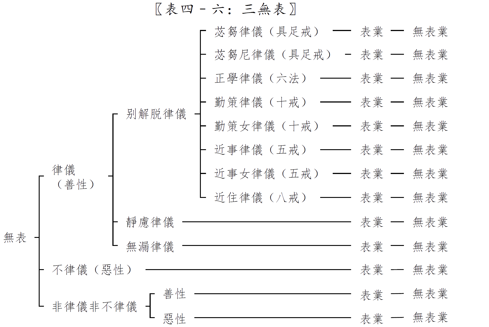
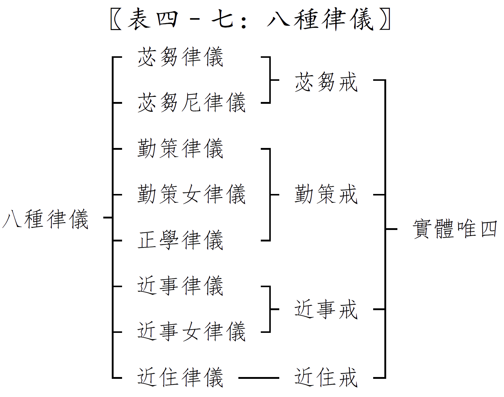
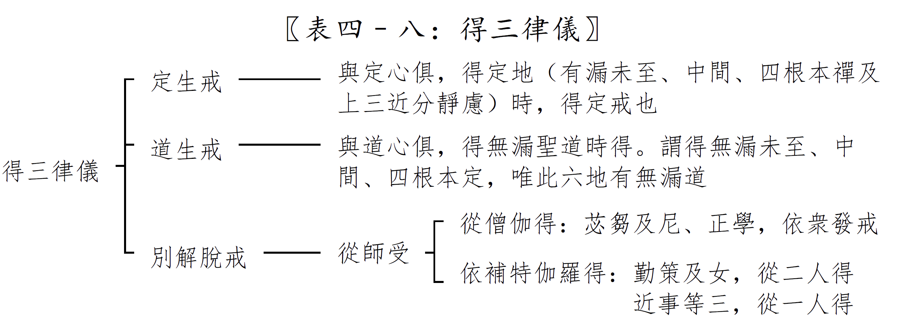
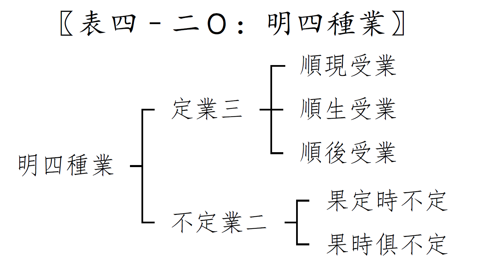

# 分别业品第四之一

## 卷13

分别业品第四之一

### 五业

有情世间，器世间的差别由业所感生。

业有两种

1. 思业。也就是意业。从等起安立。
2. 思已业。思所造的，思所推动的。
   1. 身业。依所依身安立。
      1. 表业。
      2. 无表业。
   2. 语业。约自性安立。
      1. 表业。
      2. 无表业。

### 身表语表

有部

1. 身表业的体是形色，因为有为法都是有刹那的。有刹那，是因为一切有为法最终都要消亡。
2. 正量部认为身表业的体是行动。
3. 灭本身不是果，既然不是果，那么也不需要观待因。
4. 经部说，形色也不是实有的，也不能做身表业的体。形色是依显色假安立的。
   1. 如果形色实有，那么一个色法就可以两个根取，比如眼见色，身取形色。违背教理，一个色只能一个根取。
   2. 除了显色极微，没有别的极微，所以形色是假的。
   3. 思心所依靠身的方面来动作，造作的，叫身业。发号施令的是思心所。动身思。
   4. 语业也是思心所。思心所从说话的方面来造作，叫语业。发语思。
   5. 意业的体。
      1. 审虑思。考虑。
      2. 决定思。考虑之后决定一定要这样子。

### 无表有没有

**经部**

没有实在的无表色，是假有的。所谓的无表色，是审虑思，决定思，动身思，发语思这四个现行的思心所在色心上熏的种子。这个种子可以预防做坏事。所谓无表，就是不做坏事，并不是有个实在的东西叫不做坏事，没有这个实体。

1. 不做坏事就是无表，不是有一个东西拿的出来。
2. 有部说无表依过去大种安立，受戒之后，戒体还在，但是过去大种早已过去，那么大种所造无表色应该也不是实有。
3. 无表色是色法，看不到，也没有质碍，所以不是实在有的。

**有部八个理由证明无表色实有**

1. 三色证。色有三种，有见有对，无见有对，无见无对。经说有无见无对色，那一定是无表色。没别的无见无对色了。
2. 无漏色证。经里说有无漏色，除了无表色，没有其他的色。
3. 福增长证。对佛教有净信的善男子，善女人，做了7件有依或无依，有福德的事情，他住也好，行也好，睡也好，觉也好，他的福德在他的身心上恒时相续，不断地增长，不会断掉。福业寄托在无表色那里，所以即使乱心无心的时候，福业都能够相续增长。
4. 非作成业证。大家公认的自己杀人和教他人杀人，都成业道。教的人在说话的时候并没有杀人，后来使者杀人，前者的业道如何来? 所以在杀的时候，无表在前者身上起，让教的人也成就杀生业道。
5. 法处色证。佛在一本经中，不说法处无色法，所以法处有无表色，无见无对。
6. 八道支证。正语，正业，正命，这三个是无表。因为八圣道是在定中修的，定中不说话，也不礼拜，供养，也不乞食，但是八支是全的，所以有正语，正业，正命的无表色，出定后起正语，正业，正命。
7. 分解脱戒证。如果没有无表，别解脱戒不成立，因为别解脱戒在恶心和无心中相续而转。
8. 戒为堤塘证。戒是堤塘，那么肯定是有个东西的，没有东西无法起作用。这个体就是无表色的戒。

学习中预习是加行，听课是正行，复习是结行。

**经部反驳**

1. 佛说的无见无对色是定境色，不是指无表色。
2. 无漏色也是定境色。
3. 福业增长不是因为有无表色。善的心所起现行，熏成种子。后面起其他念头的时候，种子还在，只是没有现行。思心所种子起作用，让福业增长。
4. 思心所的种子可以产生这个力量，成杀业道。
5. 是定境色。
6. 这个与无漏道同时生起的思心所，假安立名字叫无表。在这个思心所上安立正语，正业，正命，因为出定后，依这个思心所能做正语，正业，正命的事情。
7. 别解脱戒的体，也是思心所的种子。当时思心所发了愿，是现行，以后思心所种子就有这个功能。
8. 也是思心所的种子。
   1. 有说，每一支有一个种子。一共七个种子。
   2. 有说，一个种子内就有七个功德。

### 七有依福

有依，就是有所施的事物。因是善的，福是果上的，果立作因名，善业叫福业。

1. 施羁旅客。行路的人很辛苦，布施东西给他们。羁旅，客居异乡。
2. 施路行人。
3. 施有疾人。布施给有疾病的人。布施药品，帮组他做事情。
4. 施看病人。布施供养照顾病人的人。
5. 施园林。布施园林，风景等。
6. 施常乞食。凡是有乞食的人来，总是布施。
7. 随时施。凡是他需要的时候，就布施给他合适的东西。

### 无依福

无依是没有布施的东西，但对人家做，起深心的随喜，恭敬的心，一样有殊胜的福。

看到别人做好事

1. 不要起嫉妒心。
2. 要起惭愧心。
3. 要起随喜心，恭敬心。

### 无表色的大种

1. 无表色和表色所依的大种不是同一类的。一个色细，一个色粗，不可能是同一个大种所造。
2. 表色跟大种决定是同时生。
3. 欲界无表色，第一念与大种同时生，第二念以后，都是依过去大种生。过去大种是转因，主要的，所依，手推轮子的手。现在大种是随转因，次要的，依，手推轮子的大地，过去大种把他造出来，现在大种把他继续下去。
4. 色界定共无表，与大种同时生。
5. 有漏的无表色，依自地大种。有漏的无表色包括别解脱戒和定共戒。
6. 无漏的无表色，身体生在哪一界，就是哪一界四大种所造。无漏戒就是道共无表。比如生在欲界，无漏法现前的时候，这个道共戒是欲界四大所起，不是看依那个地得无漏。

### 五类分别门

1. 一切无表色都不是极微所成，没有质碍，没有执受。
2. 无表的等流性。
   1. 同类因生的，是等流性。
   2. 与苦法忍同时生起的道共无表，不是等流，是属于刹那的。
3. 无表只在有情身上产生。
4. 欲界别解脱戒无表色所依大种是等流性，有执受。身三口四，每一支都是个别的四大所造。
5. 色界定共戒无表色所依大种无执受。定共戒和道共戒中，对所依四大有长养，因为在定中。无执受。定中无表七支，是同一四大所造，因为与定心同时生起，七支互望是同一果，俱有因。
6. 表色是同类因生，只有等流性。
7. 身表是属于身上的，是有执受的。语表不属身，无执受。

### 三性门

1. 无表色决定是有记的。表业和意业三性都有。要产生无表色，发动的心决定很强，这样发动表业后，还能带动无表色。如果发动的心很微弱，只能起表业，起不了无表业。无记心力量微弱。无表业决定是善心或不善心发动的，所发动的无表业也随发动的心属于善或者不善。
2. 不善的只有欲界有。
3. 无色界没有无表色，因为无色界没有色法。
4. 表业只在有伺地有，即有寻有伺地和无寻唯伺地，包括欲界和初禅，因为五识唯寻伺。
5. 欲界没有有覆无记的表业，因为没有有覆无记的等起心。欲界有有覆无记的心， 比如身见， 边见相应的心，但是这两个心是见所断，不能发业，因为是迷理的，内门转，不对外。凡是发业的心，决定是修所断。
6. 有覆无记的表业只有初禅有。谄狂两个心，在初禅天是有覆无记，可以发表业，比如大梵天和马胜比丘。欲界的谄狂心是不善心。
7. 表业的善恶也由等起心的善恶来看。

### 无色界于欲界有四远

1. 所依远。入无色定的等无间缘，不能依靠欲界的心，决定是依靠色界的第四禅心。
2. 行相远。无色界是厌离第四禅的粗苦障，欲界的粗苦障早已远离。
3. 所缘远。无色界在四禅以上，欲界的境太远，不会去缘。
4. 对治远。无色界对治的是四禅的粗苦障。

### 四种善

身语业有善不善，但是能造的大种是无记的，因为造业的那个人是心要造业，不是大种要造业。业根据它的心等起，等流下来，有善，不善。而四大种不是它要造的，不是它发动的一个目的，所以四大种不随等起心成善，不善。

1. 胜义善。解脱，涅槃。择灭无为。因为最极安稳。
2. 自性善。惭，愧，无贪，无嗔，无痴三善根。比如良药。
3. 相应善。和自性善相应的心王心所。比如杂药水的水。
4. 等起善。善的心发动的那些色业，即身语表和无表，身语上的四相，得，二无心定。比如良药汁喂牛，牛的乳也有药的味道和作用。

### 四种不善

1. 胜义不善。生死法，苦为自性。极不安稳。
2. 自性不善。无惭，无愧，贪，嗔，痴三不善根。比如毒药。
3. 相应不善。和自性不善相应的心王心所。比如杂毒水的水。
4. 等起不善。不善的心发动的那些色业，即身语表和无表，及身语上的四相，得。比如毒药汁喂牛，牛的乳也有毒药的味道和作用。

### 二种无记

1. 胜义无记。虚空无为，非择灭无为。
2. 自性无记。

无相应无记和等起无记。无记不是因为相应和等起才成无记，非善非恶就是无记。有为无记都归为自性无记即可。

### 两种等起

见所断的烦恼不能发表业，所以说欲界没有有覆无记的表业，因为没有有覆无记的修所断烦恼。身见边见虽然是有覆无记，它是见所断烦恼，不能发表业。

> 经上说：由邪见故，起邪思维，邪语，邪业，邪命。

这样一来，由邪见，发动身语意三业，和前面的矛盾。不矛盾的原因如下。

发动表色，无表色的心，有两种。

1. 因等起。转。发业之前，起一个心，这个心叫因等起。
2. 刹那等起。随转。正在造业时，跟业同时生起的心。

转随转的四料简。

1. 转，非随转。见所断的识。帮助寻伺，能起表的，不能作随转。
2. 非转，随转。前五识。没有计度和随念分别，只能做随转。前五识对外不对内。
3. 转，随转。修所断的烦恼相应意识。修所断，迷事，对外境。意识有计度和随念分别。
4. 非转，非随转。无漏法，异熟生法。起无漏心在定中，不能造表业。异熟心自己起来的，不能发业。

邪见是见所断的烦恼，虽然能发身语意三业，但是在造业时，决定还有一个近的等起，刹那等起，这个刹那等起是修所断的烦恼。经上所说的，是把中间修所断的刹那等起略掉了。邪见是远因，因等起。论里的说法，是从刹那等起来说，只有修所断的烦恼能作表业的等起，没有矛盾。

转是善恶无记，随转都可以分别有三性。但是佛的转是善，随转必定是善，转是无记，随转是善或无记。

有部说佛有无记心。比如异熟生的无记心，通果心，威仪路。

大众部说佛没有无记心，佛一向是善的。佛行住坐卧无不在定中，都是善的。

## 卷14

分别业品第四之二

### 三无表

律仪能够遮止，消灭恶戒在我们身心上的相续。

受戒后能够断恶戒的相续。持一个不杀戒，对一切有情施无畏，让他们不要害怕。

不持戒，只是一辈子不杀，并没有对一切有情起无畏的布施。

### 律仪补充

1. 别解脱律仪，又名波罗提木叉，可以在散心中有。因为对治恶戒，恶戒只在欲界中有。欲缠戒。有表业。也有无表业。遮不律仪。
2. 定共戒，只有定中有。色缠戒。得到色界定，产生的。没有表业。灭不律仪，实际上种子断不了。
3. 道共戒，只有定中有。无漏法得到之后，同时生起的道共戒。没有表业。灭不律仪。

律，一般指调恶的方法，依律而行，行动，威仪依律来做的，叫律仪。恶戒是不律仪的另外一个名字。

### 别解脱律仪

正学律仪，在比丘尼戒之前受两年，也就是式叉摩那戒。这两年中，对五戒和非时食特别加重地学。是在沙弥尼戒的基础上，特别着重地行持这六个戒，没有离开沙弥戒的体。另外一方面观察她如果过去有胎，这两年中间可以养下了。正学女里的是不淫欲，不是邪淫。

勤策律仪。勤是比丘策励沙弥好好去修行。因为自己修不来，要靠大僧策励他精进修行。

近住律仪，也就是八关斋戒。受了这八条戒，可以亲近阿罗汉住，亲近他学。

比丘尼戒348条，因为烦恼重，要防护的更严格一些，所以戒相要多一点。

近事如果转形，本来是男居士，变成女居士，不需要重新再受戒，因为戒体还在。

近事戒，勤策戒，比丘戒，不是累加起来的。比丘身上，同时具足顿起这三个律仪。所以比丘身上有250+10+5=265个戒。三个律仪里都有不杀，但层次有高低，因为受戒的因缘不一样，所以戒体互相观待也有差异。

1. 因。求戒的心。发心不一样有高低不同，戒体也不一样。
2. 缘。比如戒师，居士戒一个师就可以授，沙弥戒最少两个师，比丘戒十个师。
3. 反证。假使不是三个律仪具足顿生，比丘戒一舍的话，居士戒和沙弥戒都没有了，但是实际上当居士还是可以的，不要再受居士戒。

要先受近事戒，才能受沙弥戒，进而才能受比丘戒。

1. 以轻漫心，认为自己是利根，直接受比丘戒，这样不得戒。
2. 假如受戒的人不知道，直接受比丘戒，那么受的人得戒，戒师有罪。

比丘戒250条，这250条做到，基本上一切都在里头，所以比丘戒叫具足戒。

|              | 杀生 | 不与取 |        | 虚诳语 | 饮诸酒 |                    | 眠坐高广严丽床座 | 食非时食 |          |          |
| :----------: | :--: | :----: | :----: | :----: | :----: | :----------------: | :--------------: | :------: | :------: | :------: |
| **近事律仪** |  ✅   |   ✅    | 欲邪行 |   ✅    |   ✅    |                    |                  |          |          |          |
| **近住律仪** |  ✅   |   ✅    | 非梵行 |   ✅    |   ✅    |  涂饰香鬘歌舞观听  |        ✅         |    ✅     |          |          |
| **勤策律仪** |  ✅   |   ✅    | 非梵行 |   ✅    |   ✅    |      涂饰香鬘      |        ✅         |    ✅     | 歌舞观听 | 受持金银 |
| **苾刍律仪** |      |        |        |        |        | 一切不如法的身语业 |                  |          |          |          |

其中，虚诳语包括两舌，绮语，恶口。

非时食，药可以吃。水果不可以。茶水可以，但是茶叶不能吃下去。

比丘戒，指身语，不包含意。开始从身语下手，身欲入了轨道，意也慢慢入轨道。

### 别解脱戒的其他名字

八种别解脱戒的任何一种都可以叫这些名字。

1. 尸罗。原意是清凉。贪嗔痴三毒，是烦恼的火，受戒后，当下能防止它，能熄灭烦恼火，叫清凉。
2. 妙行。智者对尸罗师大加赞叹的。
3. 业。别解脱戒本身是造作。因为受戒的时候，磕头拜礼，白羯磨词等，是有所造作。无表色依这些造作而来，所以叫所作。 
4. 律仪。能防身语不做坏事。
5. 别解脱。表色和无表色的最初一刹那，那一念。
6. 业道。表色和无表色的最初一刹那，那一念。业最初产生的一刹那这一念头。

别解脱，只有在最初一刹那。第二念以后恶已经弃掉了，不能再叫别解脱。

别解脱律仪，通第一念到最后没捨之前。初念的别解脱，依它的法去行持的行仪，叫别解脱律仪。

业道，求戒的思，是业，正达到目的的时候叫业道。第二念已经达到了，不能再叫业道。第一念的戒体叫道。业在上面走。

后起，第二念以后，已经满了愿，是根本业道后来起的东西。

### 三戒成就

苾刍，是一种草的名字，这种草有很多功德，以这个草来比喻苾刍有很多功德。比丘和苾刍在古印度话里是一个，比丘是以前译的，看不出草的意思来。玄奘法师翻译为苾刍，就看出了草的意思。

1. 别解脱律仪。比丘，比丘尼，式叉摩那，沙弥，沙弥尼，近事男，近事女，近住，这八种人成就。乱心无心都有。外道的不杀等，不是律仪，而是处中无表，即非律仪非不律仪。
2. 静虑律仪。得静虑的人成就，包括四根本静虑，未至，中间，上三近分。近分定虽然没有达到根本静虑，但是它已经进入静虑的范围，也可以叫静虑。随心转，入定才有。
3. 无漏律仪。得无漏道的人成就，即见道以上。得了道共戒，对三宝信心不退，任运不犯五戒，不管生在哪里，不管是否碰到佛教，断命也不犯五戒。随心转，入定才有。

### 断律仪

未到地定的九个无间道同时生起的定共戒或道共戒，叫断律仪。因为这两个能断掉欲界所系缚的恶戒，更能够断掉起恶戒的那个烦恼。

1. 前八无间道，俱生二戒。只能断欲界起恶戒的烦恼。断前八品烦恼。断烦恼本身，自性断。
2. 第九无间道，俱生二戒。断欲界起恶戒的烦恼，以及断恶戒。断最后一品烦恼，同时断恶戒。恶戒需要缘缚断，前八品断了，第九品还在那里会缘它，要把九品烦恼全断掉，这个恶戒才断。

有部的观点，烦恼能自性断，色法不能自性断，只能缘缚断，能缘它的烦恼断完，才叫断。恶戒是无表色，是色法。恶戒就是不律仪。

断欲界烦恼的，只有未到地定。解脱道不断惑，所以断律仪取无间道。

静虑律仪四料简。

1. 有静虑律仪，非断律仪。 除掉未至定九无间道，未至定有漏解脱道，上地有漏的静虑律仪。
2. 非静虑律仪，有断律仪。依未到地定的道共戒的九无间道。
3. 有静虑律仪，有断律仪。依未到地定的定共戒的九无间道。
4. 非静虑律仪，非断律仪。依未到地定的道共戒的九解脱道，以及上地的一切无漏律仪。

### 意律仪

身律仪，语律仪就是别解脱戒，身语七支。

正知，正念这两个心所合起来之后，就叫做根律仪，也叫做意律仪。提起正知正念，这就是意律仪。眼根律仪就是眼看东西的时候提起正知正念，不起烦恼。

正知的体是慧心所。正念的体是念心所。根律仪，意律仪，都依正知正念，跟前面的律仪无表色不一样。

### 表业无表业的三世成就

1. 别解脱律仪的无表色，没捨的话，第一念成就现在，第二念以后成就过去和现在。因为不随心转的色法，力量微弱，没有法前得。
2. 不律仪的无表色，也就是恶戒。比如杀猪。没捨的话，第一念成就现在，第二念以后成就过去和现在。
3. 静虑律仪。得到静虑律仪，总成就过去和未来，因为力量强，有法前得和法后得。定中也成就现在。现在一刹那得定后，过去失去的定共戒都成就。
4. 无漏律仪。第一念的无漏法，苦法忍，只成就现在，过去没有无漏法，不能成就。第二刹那后可以成就过去。定中也成就现在。

5. 处中无表。也就是非律仪非不律仪。
   1. 马马虎虎，糊里糊涂的心做善事恶事，没有无表色。
   2. 强有力的心做的善恶，成就处中无表。第一念成就现在，第二念以后成就过去和现在。
   3. 善戒里做坏事，比如受了比丘戒，但是做了坏事，有无表色，是处中无表。第一念成就现在，第二念以后成就过去和现在。做坏事的力量没有了，这个处中无表也没有了。
   4. 恶戒里做善事，比如杀猪的人，但是做了好事，有无表色，是处中无表。第一念成就现在，第二念以后成就过去和现在。做好事的力量没有了，这个处中无表也没有了。

6. 善恶的表业正在作的时候，成就现在。第二念以后成就过去，法后得，未来不成就，因为表业是色法，比较顿，无法前得。这个表业包括律仪不律仪的表业和处中表业。
7. 有覆和无覆两种无记的表业，只成就现在，因为力量更弱了。表业从心发，推动它的心是无记心。表业虽然只能成现在，但是能发的心却可以通三世，比如工巧明，通果心。

### 恶戒的其他名字

恶戒就是不律仪。

1. 恶行。有智慧的人所呵斥，所厌恶。感不可爱的果。
2. 恶戒。对律仪有污损的。
3. 业。身语所造。
4. 业道。思心所第一次满愿得时候，第一刹那叫业道，第二刹那以后，不能叫业道，只能叫业。
5. 不律仪。不禁止身语，放任它去做坏事。

### 表业无表业四料简

1. 成就表业，不成就无表业。住在非律仪，非不律仪的人，动念造作的思心所微劣。无表业要强有力的心才能发起来。
2. 不成就表业，成就无表业。预流和一来圣者，前一辈子证了圣者位，第二辈子又来投生，在胎里的时候，无表业，前辈子表业已经捨了，但是他们成就过去未来的定共无表和道共无表。无色界圣者，只成就过去未来的道共无表，因为道共无表不系于三界。
3. 成就表业，成就无表业。
   1. 住在非律仪，非不律仪的人，重的善心或重的恶心造业。
   2. 未经生的圣人，这辈子证了圣者，没有命终。
4. 不成就表业，不成就无表业。凡夫在胎里面。

### 得三律仪

1. 定共戒得了有漏定之后就有。无色界无色法，没有定共戒。
2. 前面得了定的人，假使得了无漏道，就得道共戒。上三近分定不生无漏道。
3. 别解脱律仪要人教授。
   1. 比丘戒，比丘尼戒，正学女戒，从僧众得。
   2. 勤策戒，依两个师。五戒，八戒，依一个师。

4. 得具足戒，有十种方式。里面有些没有表业。
   1. 佛，独觉，他们成道的时候，无师智得到了，就得具足戒。
   2. 见道之后，能得具足戒。比如憍陈如等五比丘。
   3. 佛证道初八年里，碰到那些善根好的，说一句善来苾刍，他们须发自落，袈裟着身，行住威仪如二十年老比丘，当下得到具足戒。比如耶舍长者子。他自己本来求戒的愿力叫善，佛的威力加被叫来。外力要通过你本身的愿力才起作用。
   4. 由信受佛为大师，得具足戒，比如大迦叶。
   5. 由善巧酬答得戒。这是一种开许。比如苏陀夷。佛问他，你的家在哪里啊，他说三界无家。
   6. 由敬受八尊重法。如摩诃波阇波提，佛的姨母。佛的姨母是她的父母在大梵天王前祈求来的。大梵天王的名字叫大生主。摩诃波阇波提就是大生主。佛说如果女人出家的话，将来佛的正法要少五百年。阿难请求，佛说如果他们能受八敬法，那么也可以。佛的姨母听了八敬法，起大恭敬心，当下得了戒。如果行了八敬法，虽然女人出家，正法还是可以维持1000年。什么叫八敬法呢？
      1. 100岁的比丘尼看到才安了居的初岁的，一岁的比丘要磕头。不安居的可以不磕头。
      2. 不得骂比丘，不得谤比丘，不能说比丘的坏话。
      3. 自恣的时候，或者其他羯磨的时候，比丘尼不能举比丘的过。
      4. 从大僧里受戒。
      5. 比丘尼，犯僧残（罪名）应于半月中在二部之僧（比丘、比丘尼）中行摩那埵。为大僧办事。
      6. 每半月要到僧团里面求教戒。
      7. 不能独立安居，要依止僧团安居
      8. 自恣的时候，也要去僧团里自恣。
   7. 由谴使。派一个使者给她个别地受戒。比如一个叫法授的比丘尼，这个是特殊情况，佛开许才可以的。
   8. 边地僧人太少了，可以五个人授，一个人作羯磨，四个人称僧。本来要10个师，三师七证。
   9. 在中国，指佛教兴盛的地方，要10个师，三师七证。
   10. 说三皈依，归依佛，归依法，归依僧，说三次，也可以得具足戒，这也是利根的。

### 戒的时长

1. 别解脱律仪。
   1. 近住戒。一日一夜。但经部说可以一昼夜，二昼夜，三昼夜。有部不许经部的说法，只能一昼夜。
   2. 其他戒。尽形寿。
2. 不律仪。尽形寿。

### 近住戒

八关斋戒是在家人学习出家人，亲近阿罗汉或者有修有证的出家人的一个必要条件。

近住有两个意思，一个是近阿罗汉住，一个是近尽寿戒住。

1. 受近住戒决定是早上，太阳出来了，日出时，第二天日出时结束。一般午后受八关斋戒不得戒，但是有例外，比如受了菩萨戒的人，每个月初八或六斋日要受八关斋戒，这一天如果碰到特别因缘上午错过了受戒的机会，可以下午受戒。
2. 在师的下座。因为不恭敬，不发律仪。
3. 从师受。要持午的比丘，因为不非时食是一个重要的问题。比丘身上没有八戒，所以比丘也能受八戒。师可以使你有惭愧心。
4. 随师教说。师说一遍，他照说一遍。
5. 具足受八支。不允许少受一支。
6. 离严饰。庄严的香花，华丽的装饰，产生憍逸的地方要远离。
7. 受一昼夜。

八关斋戒的八支如下。

1. 戒支。离杀，盗，淫，妄语。防止性罪。
2. 不放逸支。不饮酒。喝了酒必定放逸。放逸后，会触犯性戒。防止失念。
3. 禁约支。香花鬘涂身，歌舞伎乐，高广大床等。不要执着那些享受的东西，要趣向厌离，出离，不要去贪三界的那些东西。防憍逸。

八斋支为什么叫八斋支？

1. 经部的说法，八种总的名字叫斋，每一条叫支。斋是假安立的，没有实体。
2. 有部的说法，第八条不非时食，是总的斋的体。不非时食是斋也是斋支。其余七个是八中之一，是斋支，不是斋。

不受五戒，也可以受八戒。但是没有受三归依的人，不能受八戒。

一般来说，先受三归依，再受五戒，再受八戒。

如果受戒的人不知道要先受三归依，才能受近住戒，去受的话，意乐心强也可以得近住律仪，但是授戒的戒师有罪。

### 近事戒

1. 受近事戒。
   1. 经部。受三皈，也叫近事，三皈近事。受五戒，也叫近事，五戒近事。受三皈的时候，还没有发五戒。五戒中酒戒必须受，其余四条受1-4都可以。
   2. 有部。受了三皈，五戒的体就有了，但是戒相没有说，是可以的。没有五戒不能叫近事。鄔波索迦就是近事，这是新译，旧译是优婆塞。二根，黄门不能得戒，不能受归依。在说自己是鄔波索迦的时候，发五戒的体，就像一白三羯磨，羯磨完了比丘戒的体就有了，这个时候还没有给他说戒相。
   3. 经部。如果受了三归依，五戒体就有的话，要具足五戒才能叫近事，为什么佛经说近事有4中，持五戒的时候，四个性罪里只能持一条，持二条，乃至四条。
   4. 有部。五戒的体是有的，但是能持的有1-4条，不是受1-4条。所以戒体是全的。

### 三品戒

近事，比丘等这些戒，分上中下三品，依发心的殊胜。

戒师不清净，仪式不如法，发心再殊胜也不得戒，因为条件不够。

其他条件都如法，那么发上品心，得上品戒，中品心得中品戒，下品心得下品戒。

往生也一样，三品往生，九品往生，看发心。

阿罗汉受比丘戒的时候也可以成下品戒。比如发的是自了汉的心。

凡夫发殊胜的上品心，也能得上品戒。比如发的是殊胜的菩提心，是成佛度众生，住持正法的愿。

### 三归依

一般的说。

1. 归依佛。归依佛的两足尊，乃至三十二相，八十种好。
2. 归依法。一切经典。
3. 归依僧。菩萨，罗汉，乃至现在出了家的这个僧。

有部的说法。

1. 归依佛。归依成佛的无学法，也就是佛的尽智，无生智，以无漏五蕴为体。
2. 归依法。归依涅槃，涅槃就是择灭。
3. 归依僧。归依成就圣者的有学，无学法。

世亲菩萨的说法。

1. 归依佛。成佛的无学法和佛身。
2. 归依法。归依涅槃。
3. 归依僧。归依成就圣者的有学，无学法，和圣僧，菩萨。

所归依的是佛，法，僧。

能归依的是语表业，因为要说。不说不成归依。

归依就是求救，投靠的意思。

受五戒的时候，有五戒的三皈。受八戒的时候，有八戒的三皈。受十戒的时候，有十戒的三皈。这些三皈不一样，有层次的高低。

### 近事戒的离邪行

近事戒里离邪行。自己的妻子不非时，非分的不算犯戒。

其他戒里离非梵行。

1. 邪行是大家都呵斥的。非梵行世间上并不反对。
2. 邪行容易出离。非梵行离开困难，一般都做不到。接引那些才信佛上路的人，不能要求太高。
3. 圣者证道后，天然不做邪行。而非梵行，初果二果还有。

### 近事戒的娶妻不犯

一个居士，受五戒的时候单身，后来娶妻了，不犯近事戒。

得律仪，看你发的什么誓。如果发不淫欲的誓言，娶妻就犯，如果发的不邪淫的誓言，娶妻不犯。

### 近事戒的离虚诳语

近事戒里，不立恶口，离间语，绮语，只立虚诳语，有三个原因。开了虚诳语，犯了戒说没犯戒，就要违背戒，其他的戒就不可靠。严格的说，这里的妄语戒也包括离间语，恶口，绮语，但是条相里面只制一个虚诳语，是重点。

1. 最可呵。
2. 在家的容易远离。
3. 圣者得不作。圣者投生后，天然不会打诳语。圣者天然不犯五近事戒。

### 近事戒的离酒

为了保护其他律仪，酒一开的话，其他的戒就守不住。遮罪虽然很多，但是酒的过失特别重，因为喝了酒后，心放逸。

很多人以为自己没醉，实际上早就醉了。

性罪。本身就是罪。一定是染污相。

遮罪。佛遮制的，遮止不当行为。不一定是染污相，比如药酒。

## 卷15

分别业品第四之三

### 得律仪处时

1. 得别解脱律仪的三个条件。
   1. 从一切。一切就是根本，加行，后得，都发别解脱律仪。别解脱戒，不但是根本业道要遮止，加行和后起也要遮止。
   2. 从二。从有情和非情都能发别解脱律仪。
      1. 有情类性罪，比如杀生，遮罪比如和女人在同一个房间过夜。
      2. 非情类性罪，比如偷盗，遮罪比如掘地，坏鬼神村（砍树）等。
   3. 从现在。过去，未来不能发别解脱律仪。因为别解脱戒依有情处转。有情处有两种。有情处是现在的，过去，未来的不能叫有情处。
      1. 有情。有情本身，比如邪淫，就是这个女子。
      2. 有情处。
         1. 所依处。是有情。比如邪淫，女子没有成家，对她的父母有罪。
         2. 所止处。是非情，是器世间，是她生活的地方。

2. 得静虑律仪和无漏律仪。
   1. 从根本。加行，后起不得。决定是得了定才起来，随心转戒。所对治的恶处也只能是根本的，加行，后起不对治。尚且不从性罪的加行后起处发戒，何况遮罪。
   2. 通过去，现在，未来。跟定共戒，道共戒同时生起的心，能缘三世。反过来，跟定心同时生起的定共戒，道共戒，也能对三世起作用。对三世都可以防止不起罪，不做罪。过去的，现在的，已经起来了，用不着防，真正防止，就是防未来。

四料简定共戒，道共戒，别解脱戒。

1. 得别解脱戒，不得定共道共戒。现在世的加行，后起，遮罪。
2. 不得别解脱戒，得定共道共戒。从过去，未来得戒，且又从根本业道得戒。
3. 得别解脱戒，得定共道共戒。从现在世，且根本业道。
4. 不得别解脱戒，不得定共道共戒。过去未来的加行，后起，遮罪。

世亲菩萨纠正，第一和第三的现在世应该改为现在处，因为现在世如果在造恶业，不可能得到善律仪，得善律仪的时候，不可能有恶业道。当下业道本身没有，但是可以发业的处还是有的。

### 得律仪有情支因

1. 得律仪。
   1. 从一切有情发戒。持戒是以一切有情为对象的。发菩提心也是对一切有情。不持戒的话，没发誓，碰到恶的，你恨的，你还是会杀他，现在不过是没有那个缘。
   2. 支不定。支是身口七支。比如比丘戒，七支都有。勤策，近事，只有四支。
   3. 因不定。受戒的心。只能起一个心，起下品心或中品心或上品心。比如下品心受近住戒，近事戒，勤策戒，那么就是非一切因。如果下品心受近住戒，中品心受近事戒，上品心受勤策戒，就有了一切因。
   4. 得别解脱戒，不能有五个定限，如果有，就得不到别解脱戒。
      1. 有情定。某些不杀，某些要杀的。
      2. 支定限。除了近事戒，可以暂时学几条，其他的比丘戒，近住戒，沙弥戒，必须全部受。
      3. 处所定。在某个地方不杀，在某些地方杀。
      4. 时定。比如佛的圣诞日不杀，其他时候杀。
      5. 缘定。某些因缘下不杀，某些因缘下杀。
2. 得不律仪。
   1. 从一切有情发。一切有情没有拣择，都可以杀。
   2. 一切支。没有支分差别，身三口四，他都会造恶。
   3. 非一切因。只能起一个心，或下品，或中品，或上品。
   4. 辩论。
      1. 经部。一个杀羊的人，有不律仪的，但是一生中却不偷东西。怎么说一切支？
      2. 有部。经部举的这个例子，不叫不律仪，只能叫处中的恶的律仪。因为不律仪决定对一切有情，也一切支具足，而且要尽形寿干的。
      3. 经部。杀羊的人，他不会杀自己的妻子，儿女，父母。
      4. 有部。现世不杀，下辈子他的孩子做了羊，一样杀。
      5. 经部。现在不是羊，没有害心。而你说遍一切有情。
      6. 经部。不管是不是尽形寿，不管七支是否具足，不管是不是对一切有情，都可以得不律仪。八关斋戒除外，只有一天一夜，要具支，遍有情。
      7. 世亲菩萨偏向经部。

### 得恶处中律仪

1. 得恶律仪。
   1. 由作。生在不律仪的家庭，长大一点开始操作那个职业，才起加行的时候，恶戒就起了。
   2. 由誓受。要发誓。不是生在恶律仪家庭，但是为了自己活命，要做杀害的事情。他发一个誓愿，从现在开始，乃至命终，这一辈子靠这个职业谋生。发愿得时候，恶戒就起了。

2. 得处中无表。
   1. 由田。福田，如布施供养父母，三宝。
   2. 由受。自己发誓。比如自己发誓早上起来不拜佛，不吃早饭。誓心起，处中无表就起。
   3. 由作。自己起一个殷重的心，一定要做好事，或坏事。

### 捨别解脱戒

1. 有部说法。调服就是戒，就是律仪。律仪使人不做坏事，使根调服，不随烦恼转。除了近住戒，其他七种，由四个条件舍戒。

   1. 故捨。不想修行了，自己发心故意捨掉。有三个条件。
      1. 自己心里不愿意持戒，有厌戒心。别人强迫你，心里不舍，条件也不具备。
      2. 决定要对人说。只要能懂你话的人就行。
      3. 决定要自己说捨戒的话。

   2. 命终。别解脱戒，命终以后就没了。菩萨戒命终不舍可以。

   3. 二形俱生。二形和五种不男，不生戒体。转根不捨戒。二形生舍戒，黄门不舍戒。

   4. 断善根。戒体是建立在善根上的。
   5. 夜尽。只针对八关斋戒。八关斋戒是一日一夜。

2. 经部说法。犯了根本戒，就舍戒。比如比丘戒根本戒犯一条，就驱摈。不能忏悔。

3. 法密部说法。正法灭尽的时候，别解脱戒的戒体也没有了。法灭就是一切学处，结界，羯磨等法都消灭了。

4. 有部反驳。犯根本戒没有捨戒体，只不过是犯了一个大戒，这个比丘有两个名字，叫持犯戒。就比如财主做生意欠了一大笔债，即欠债，又有本来的其他财产。只要发露悔除，还是具足戒的，就像把债还掉了。一般都不采取这个说法，犯了戒就驱摈，戒体没有了。

5. 辩论。

   1. 经部。佛经说的，犯了根本重罪的人，再没有沙门性，破苾刍体。真正地说，沙门是有无漏道的人。
   2. 有部。比丘有好几种，世尊说的非比丘，指不是胜义比丘，就是圣者。犯了根本罪，这一辈子不能成圣果。并不是说没有比丘体。
   3. 经部。四种比丘。犯重比丘，客观上戒体没有了。所有犯重捨戒。
      1. 相似比丘。世俗人冒充比丘。
      2. 自称比丘。犯重的，自己还以为是比丘，实际上没有比丘体。
      3. 乞丐比丘。出家人以行乞为生活的，正规的比丘。
      4. 破惑比丘。圣者，断了烦恼的比丘。
   4. 有部。四种沙门。
      1. 胜道沙门。佛，独觉。
      2. 示道沙门。舍利弗，能够说法教化的。
      3. 命道沙门。比如阿难，还没有给人家说法示道，自己能够勤修戒定慧。
      4. 污道沙门。犯重的比丘。沙门体还在，不过是染污了。
   5. 经部。污道沙门和相似沙门一样，虽然有沙门的名字，但不是真的沙门。戒体没有了，不能叫比丘。
   6. 世亲菩萨同意经部说法。法灭后，没得戒的人，再得戒体已经不可能，但是已经得戒的，不会因为法灭，他的戒体自然消失。

### 捨定共戒道共戒

1. 定共戒。
   1. 由易地。三界九地，从一地生到另外一地。
   2. 由退。定退了。
   3. 捨众同分不一定易地。善根的捨，不一定要易地，当地也可以捨，易地当然也同样捨，只要命终了就捨，如暖顶和忍的中下品，命终会捨。到忍的上品和世第一，不会死也不会捨。暖顶忍世第一是得了定的人才有。
   4. 无色界没有定共戒，因为没有色法，但是它的定也是易地捨和退捨。
2. 道共戒。
   1. 由得果。捨前面的果，得到后面殊胜的道共戒。
   2. 由练根。钝根的道共戒捨掉，得到利根的道共戒。
   3. 由退失。道退了。四果如果退了，这一辈子会很快恢复的。
      1. 有部。2,3,4果都会退。
      2. 经部。2,3果可能退。阿罗汉果不会退。
      3. 上座部。四果都不退。

### 捨不律仪

如果以前有恶律仪，就算这些坏事现在不做了，如果不受别解脱戒，恶律仪还是去不掉的。

1. 由命终。
2. 由得别解脱戒，或定共戒。有恶戒的人，不会得道共戒。得定共戒也很难。
3. 由二形生。因为这样的人，没有坚定心，不是法器，不能做大事。假使做了坏事，只得处中无表。成黄门不捨戒。

### 捨处中无表

处中无表由六个缘捨。

1. 由受断。自己发愿，把以前所受的那个捨掉。
2. 由势断。本来得处中无表是由净信或者烦恼的力量，现在这个力量没了，无表也就捨掉了。
3. 由作业断。本来是要这样做的，后来不做了。比如每天早上吃饭前礼佛，现在不拜了。
4. 由事物断坏。比如以前布施的东西，这些东西坏掉了。
5. 由寿命断。
6. 由根断。包括善根和不善根。如本来处中无表由善根发动的，善根断了，所发的无表色也就没有了。处中无表力量比较弱一点，只要起加行，在断善根的时候，善根还没有断，只要起了加行要断它，这个处中无表就没有了。

### 捨非色的善法染法

1. 欲界非色的善法。
   1. 善根断。三界的有漏法属于界系的，离开了这个界，这个界的法就都离开了。
   2. 生上界。
2. 三界非色的染污法。需要生对治道。

### 得善恶律仪的有情

1. 恶律仪。
   1. 人间三洲，北洲没有。北洲的人，有惭愧心，没有那么重的烦恼，没有苦，善的戒也没有。
   2. 二黄门。不得善戒和恶戒。
      1. 扇搋。没有根。
         1. 生而不具。
         2. 以刀去者。
      2. 半择迦。有根而不具。
         1. 妒不男，因見他之婬，方有妒心，而根勃發者。
         2. 變不男，根能變現，遇男則女根起，遇女則男根起者。
         3. 半不男，半月為男根之用，而半月不為者。
      3. 另外一种解释是上面的五種之不男，通名為半擇迦，扇搋唯限于無根。
   3. 二形。不得善戒和恶戒。
2. 善律仪。
   1. 人间，除北洲。有别解脱律仪，定共戒，道共戒。北洲没有佛法，不能受戒，也不入定。
   2. 欲界天，色界。有静虑律仪。没有别解脱律仪，因为天上太舒服。也有道共戒。
   3. 无色界。成就定共戒，但是无现行，因为没有色法。道共戒的法前得法后得有，没有法俱得因为没有色法。
   4. 中间定，无想天。没有无漏法。无想天只能成就定共戒，没有定共戒。
   5. 二形人，二黄门。善戒也没有。四十二章经，欲在心里面，断了根没有用。二形人无志操，意志不坚定，淫欲心重的不得了，惭愧心微劣，没有堪能性。这一类人，像盐碱地，稻子和恶草都长不出来。因，不要去损坏一切有情的根。

### 三性业

1. 善业。安稳的业。感可爱果的。
2. 恶业。不安稳的业。感不可爱的果，苦的果。
3. 无记业。不是安稳的业，也不是不安稳的业。记是把它分为善的，不善的。不可记别，无记。

### 福等三业

1. 福业。欲界的善业。

2. 非福业。欲界的不善业，感不可爱的果。

3. 不动业。色界无色界的善业。因为根据它的处所，果是不动的，比如修初禅的定，将来决定感的是初禅的果。欲界造了升天的业，因为其他因缘，使天上受的业到人间受，所以是不定业。

   辩论。

   1. 问：前面说三灾，第四禅叫不动。怎么前三禅也叫不动？
   2. 答：不动业是从感果报来说的，不是说定里面有没有寻伺，喜，乐这些动。
   3. 问：前三禅都是有动的定，寻伺，喜，乐这些，为什么异熟果不动？
   4. 答：不动是说，感的果的将来受生处所是不会动摇的，不是说它有没有寻伺，喜，乐这些动。

### 三受业

1. 顺苦受业。欲界的不善业。色界没有不善法，染污法只有有覆无记。
2. 顺乐受业。欲界到三禅的善法。
3. 顺不苦不乐受业。四禅到无色界的善法。

这些业感的果不止是受，还要感这些受的资粮，比如相应法，俱有法，相应的心王心所，它身上所有的得和四相等，这些和顺的受一个性质，顺同一个受。

四禅以下顺舍受的业。

1. 中间禅。中间禅的业因，也是顺不苦不乐受的。
2. 发智论说有三个业一时成熟，那么说明欲界里面也有捨的异熟果。

五种顺受。

1. 自性顺受。本身就是受。
2. 相应顺受。触为体。比如顺乐受触。
3. 所缘顺受。所缘的境，可以产生受。
4. 异熟顺受。业感果，比如顺乐受业。

### 四业五业八业

三个定业，一个不定业。不定业打开，一共是五种。

有部。

1. 顺现受业，这辈子造业，这辈子受。

2. 顺生受业，这辈子造业，下辈子受。

3. 顺后受业，这辈子造业，第三生或以后受。

经部。

1. 顺现受业，这辈子造业，这辈子，以及以后生受。力量最强。

2. 顺生受业，这辈子造业，下辈子，以及以后生受。

3. 顺后受业，这辈子造业，第三生或以后受。

没有时间定，果不定。因为时间是假法，时间不能离开异熟果，时间定，果一定定。

譬喻师，经部的先驱，发展到极端的时候，就产生经部。譬喻师把业分为八种，允许时间定，果不定，把时间分为现受，生受，后受，但是果不定。以下的2,3,4就是上表中的。1是额外的。

1. 时间定，果不定。
   1. 顺现定，果不定。要么不受，受就是这辈子受。
   2. 顺生定，果不定。要么不受，受就是下辈子受。
   3. 顺后定，果不定。要么不受，受就是三辈子以后受。
2. 时间不定，果定。
3. 时间定，果定。
   1. 顺现受业。
   2. 顺生受业。
   3. 顺后受业。
4. 时间不定，果不定。

### 业的差别

世亲菩萨认为四业的说法比较好。因为从果上说定不定不合理，时间上说定不定是合理的。

这四个业有可能同一时间，四个业全部做。比如同一时间内，自己犯淫戒，派一个人杀人，派另外一个人偷盗东西，再派一个人骗人，四个业道同时成就，这四个业道罪有轻有种，一个感现生受，一个感来生受，一个感第三生后受，一个不定。

顺现受业，这辈子受，其他三个业，能够决定将来投生到哪里。

哪些地方造哪些业？三界五趣都能造四种业。

1. 地狱里面没有善的顺现受业。地狱里纯苦，没有可爱果。
2. 利根的离欲和圣者。
   1. 利根不退的凡夫对于已经离开的地，他们不会造顺生受业。顺后受，顺现受，不定受业可以有。
   2. 利根不退的圣者对于已经离开的地，顺生受业，和顺后受业都不会造。比如三果，欲界的顺生和顺后受业不会造。顺现受，不定受业可以有。
   3. 顿根会退的离开欲界的圣人，也就是三果，和离开有顶的圣人，也就是四果，退了以后，顺生受业，和顺后受业也都不会造。因为命终之前，还是会恢复果位。
3. 中有。欲界的中有，能够造二十二种业，都是顺现受的。如下11个，每位有定业，不定业，加起来二十二种业。中有跟生有，是同一类的，没有差别，同一个因引的，形状也已经是人的样子。
   1. 中有受。
   2. 胎五位受，羯羅藍、阿部曇、閉尸到缽羅奢佉。
   3. 胎外五位受，嬰孩、童子、少年、壯年、老年。

### 定业相

四大类定业决定要受果的。

1. 重惑净心。极重的烦恼，或者极清净的善心。发心厉害，猛利。
2. 恒所造。虽然不是很重的烦恼，但是经常做的。
3. 功德田起。对方是大功德田。
   1. 三宝。
   2. 得了殊胜的果位，特别强调初果和四果。
   3. 得胜定。慈心定，灭尽定。
4. 害父母。对父母起的损害心，或者损害的事业。

### 现法果业相

这一辈子马上受果，就是现报。

1. 田殊胜。佛法僧是大福田。
2. 意殊胜。发心殊胜。
3. 阿罗汉果和不还果。阿罗汉果三界烦恼永断。不还果欲界烦恼永断。那么阿罗汉的三界定业，不还果的欲界定业，决定这辈子受，相应的不定业就不受了。

### 当下受业

对以下对象造业，马上受报。这五种。才出定的时候，定中的气分还在相续而转。

1. 佛为上首的僧团。比如提婆达多害佛。
2. 灭尽定。无诤定。这些定出定的人。
3. 慈心定。这个定出定的人，气分还没有散掉。
4. 见道出来的人。
5. 修道出来的人，永断修惑的阿罗汉。

### 二受

异熟报可以唯感心受或唯感身受。

1. 善业没有寻的，包括无寻唯伺和无寻无伺，只感心受。五识要起，决定跟寻伺相应，没寻，五识不起。
2. 恶业，感得果报是苦报。只招苦报的恶业，决定是身受。因为心的苦是忧，忧不是异熟果。

### 心狂

心狂，前五识没有，决定是第六意识的事情。因为五识没有分别不会狂。

以下原因心狂。

1. 业的异熟果。造了让别人狂的业，恐吓禽兽，感的异熟果容易狂。
2. 怖。受到非人恼害等极大的恐吓，害怕，狂乱。
3. 害。非人，伤害身上的某个支节。
4. 违。四大不合，四大不调。
5. 忧。心里过分的仇忧。比如婆私吒得六个孩子都死掉了。

只有欲界有，但除北洲。地狱里总是狂的。

欲界的圣人里，佛没有，其他圣者四大不调也有狂的可能，异熟业感的狂没有，得圣道了别人吓他也不会狂，没有五畏，非人恭敬圣者，不会伤害他，他也不会忧愁。

1. 不活畏。害怕生活没有着落。
2. 恶名畏。害怕不好的名称流布。
3. 大众畏。大庭广众之间，有畏怯心。
4. 死畏。怕死。
5. 恶趣畏。怕死了投生恶趣。

色无色界天没有狂。

### 曲秽浊业

1. 依谄曲生的身口意三业，叫曲。谄曲，心不直。
2. 依嗔心生的身口意三业，叫秽。
3. 依贪心生的身口意三业，叫浊。

