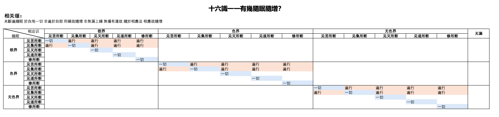

# 分别随眠品第五

### 开章

业是亲因，烦恼是缘。但是力量最大的还是烦恼，没有烦恼就不造恶业。过去的业如果没有烦恼滋润，也不感果。

断除烦恼，不造新业。

对治烦恼的三个方式。

1. 原始佛教根本道。一个一个消灭烦恼。
2. 大乘道。菠萝蜜乘。利他之中断烦恼。烦恼我执起，利他的时候，把我执甩到一边去。
3. 密乘。以毒攻毒，以大的烦恼来对治一般的烦恼。大的烦恼，当然不是指真正的烦恼。

## 卷19

分别随眠品第五之一

### 随眠介绍

随眠。

1. 随逐有情。
2. 行相微细。
3. 增昏滞。使你好的作用起不了，糊里糊涂。

有部。随眠是根本烦恼。

其他的部。随眠是烦恼的种子。

### 六随眠

器世间，有情世间的差别，从业所生。业是烦恼所生。离开烦恼，业没有能力感三有果。

1. 有烦恼才造业。没烦恼不造业，也就不感果。
2. 业造出来了，需要烦恼滋润，才能感果。

随眠，也就是根本烦恼，是三有的根本。这六个烦恼，都是贪领头的，都是因贪的根本而生起的。

### 七随眠

上二界的贪是有贪，原因如下。修定的身体和定的境界叫有。

1. 上二界是定地，大部分时间在定地，内门转。少部分时间可以缘外境。欲贪是缘欲界五欲外境。上二界的人都贪着禅定，不贪外境。
2. 有的外道认为色界，无色界的定是解脱，为了遮止这种说法，并没有解脱。释迦摩尼佛成道以前，参访婆罗门外道学习。
   1. 阿罗蓝。无所有初定。
   2. 郁陀仙。非想非非想定。

### 十随眠

贪嗔痴慢疑，天台宗的五钝使。

五见，天台宗的五利使。

### 九十八随眠

1. 十随眠，三界五部的不同，分为98个随眠。
   1. 身见，边见，只有苦谛有。
   2. 中间两个谛，只有邪见和见取见。
   3. 谓如次第，具，离三见，二见，见疑。
   4. 戒禁取直接迷道的，非道谓道。
2. 见道分苦集灭道，修道不分。
   1. 见道迷理，各有不同。
   2. 修道迷事。不分。
3. 烦恼全部断完，证阿罗汉。成佛还要一切种灭，也就是所知障的习气断完。
4. 断108个烦恼，要修的108个三昧，这是108念珠数字的来源。
5. 98使。使，是烦恼跟着我们跑，碰到机会就把我们捆起来，不使我们出三界。跟警察一样。
6. 佛教的核心教义是缘起。
   1. 性空。
   2. 如幻的缘起。
7. 苦集灭道，性空，和如幻如化的缘起，看的非常清楚，这是见道。烦恼障住我们见道。
   1. 障住我们见欲界苦谛的烦恼有10个。见到欲界苦谛，就能把他们断了。
   2. 障住我们见欲界集谛的烦恼有7个。见到欲界集谛，就能把他们断了。
   3. 戒禁取，直接违背苦谛的果，和道谛。所以集谛和灭谛没有。
   4. 以此类推。
8. 见道，修道所断的烦恼。比喻。
   1. 知道贪污不对，在那个位置上，明知故犯。
   2. 不净观，知道都是骷髅，脓血等等，碰到真的事情，不一定能够不起烦恼。
9. 十个根本烦恼里面，某些贪是见所断，某些贪是修所断。圆晖法师同意法宝法师的讲法。
   1. 普光法师。
      1. 五见和疑，是直接对四谛不明白，疑惑的，叫缘见此。明白了四谛的道理，五见和疑就没了。此是四谛。
      2. 贪嗔痴慢，对四谛不是直接迷的，但是他们可以缘五见和疑，间接地缘四谛，这叫缘见此所断。此是四谛。
      3. 贪嗔痴慢里面，
         1. 如果是缘五见和疑的，那么这个贪嗔痴慢是见所断。
         2. 其他的贪嗔痴慢，是修所断。
   2. 法宝法师。
      1. 五见和疑决定是见所断。
      2. 贪嗔痴慢，缘见道所断的五见，疑，是见所断。
      3. 其他的贪嗔痴慢，是修所断。

### 见修断

1. 见道所断。忍所断。
   1. 忍。无间道。把烦恼消灭，正在搏斗的时候。第一次消灭。
   2. 智。解脱道。证明解放，烦恼断掉了。已经见过一次。
   3. 见所断的烦恼。
      1. 如果是有顶的，只能见断。
      2. 下面其他八个地，
         1. 可以见断。圣者。
         2. 可以修断。凡夫，用世俗智断。欣上厌下。
2. 修道所断。智所断。贤圣品还要讲。
   1. 智。
   2. 修道所断的烦恼，只能修断。
      1. 圣者用无漏智和世俗智。
      2. 凡夫，用世俗智。欣上厌下。

总结：这是有部的观点。见道所断的烦恼，不是必须通过见道来断。但是修所断的烦恼，必须通过修道来断。下面八地的见断修断的烦恼都可以用世俗智来断，欣上厌下。

xxxxxx问题，如果世间道把欲界烦恼断掉了，得到初禅。见道后就是三果。那么见道的时候，欲界的见所断的烦恼还要再断一次吗？xxxxxxx

### 五见

1. 身见。执我，我所，执着五蕴是我，或五蕴中间的某一个是我，离开五蕴有一个我。

   1. 有部。萨迦耶见。萨，有，迦耶，身，和合聚集。执着身是我，我所。强调身是有的。
   2. 经部。萨迦耶见。萨，坏，无常的就叫坏。迦耶，积聚。因为外道执一个不变的灵魂。身是空的，虚妄的东西。
   3. 世亲菩萨。同意经部。

2. 边见。执我，我所，是断是常。

3. 邪见。拨无因果。做好事不得好果，做坏事也不一定得坏果。苦集灭道的因果，缘起法说是没有的。

4. 见取见。劣谓胜。不好的东西执为殊胜。执着前三个见是好的，也包括其他有漏法说是殊胜。

5. 戒禁取见。非因道妄谓。不是因说是因，不是道说是道。

   1. 戒。非道执道。迷道的，见道所断。
      1. 佛教里的五戒等。执着戒能够证涅槃，其实戒只是证涅槃的因素之一。应该是由戒生定，由定生慧，证涅槃。
      2. 真正能出离的道，毁谤它不能出离。本来不对的，执着他是清净的。
   2. 禁。外道的。两类非因执因。从常倒，我倒产生。**常见，我见，是边见身见所包含的，身是果，所以见苦所断。**迷果是因，执着果，所以是见苦断。
      1. 能生因。大自在天，生主，不是创造世间的因，他说是因。
      2. 生天因。
         1. 比如跳到恒河洗烦恼，将来生天。不是生天因，执为因。
         2. 牛戒，狗戒等各式各样的东西。执这些是涅槃的因，证涅槃的道。

   

### 四颠倒

安立四个倒的原因，在表中最右边。

戒禁取见，因为佛教里面的戒，能够感人天的福，不是全部颠倒。

断见，邪见，这两个都不增益。

其他贪嗔痴等烦恼，不是见性，没有推度功能。

想颠倒，心颠倒，是因为跟见相应，见颠倒了。五义相应。

四个颠倒里面，每一个都有想，心，见三颠倒，一共12个。

1. 有部。预流果12个全部断完，因为见是迷理的。想和心因为相应，也是迷理的。
2. 分别部。乐的想，乐的心，净的想，净的心，预流果没有断完。这四个是通见修所断。其他8个是见所断。
3. 经部。每一个的想和心，预流果都没有断完。这8个是通见修所断。其他4个是见所断。
4. 世亲菩萨，同意经部。

### 七慢

有七种慢。与别人比较，抬高自己。

1. 慢。他差，等，符合事实，自心抬举。
   1. 本来他   比   你  差，你认为 他   比  你  差，高兴。
   2. 本来他   和   你   一样，你认为 他 和  你   一样， 感觉了不得。 ————我等慢。有等我慢。无胜我慢。
2. 过慢。他好，等，你说等，差，不符合事实，比慢更近一步。
   1. 本来 他  和  你  一样，你认为   他  比  你  差。 ————我胜慢。有劣我慢。无等我慢。
   2. 本来 他  比  你  好，你认为   他  和  你  一样。
3. 慢过慢。本来他    比   你    好，你说你    比   他    好。
4. 我慢。执着有一个我，我所。
5. 增上慢。未得谓得，未证谓证。
6. 卑慢。
   1. 本来比别人差很多，但是只承认差一点。 ————我劣慢。
   2. 本来比别人差，也承认差，但是还是抬高自己。————有胜我慢。无劣我慢。
7. 邪慢。自己没德，做了坏事，以为自己有德，抬高自己。

### 九慢

从七慢里面的慢，过慢，卑慢开出这九个。

1. 我胜慢。 ————过慢。
2. 我等慢。————慢。
3. 我劣慢。————卑慢。
4. 有胜我慢。————卑慢。
5. 有等我慢。————慢。
6. 有劣我慢。 ————过慢。
7. 无胜我慢。————慢。
8. 无等我慢。 ————过慢。
9. 无劣我慢。————卑慢。虽然自己比他们差远了，感到自己其实也是很了不起。比如一个很牛的人，一个稍微有点成绩的人。

### 慢的三断门

七慢，九慢，都是通见断修断。

1. 缘见所断的烦恼起的，那么这个慢是见所断。
   1. 五见和疑决定是见所断。
   2. 贪嗔痴慢，缘见道所断的五见，疑，是见所断。
   3. 其他的贪嗔痴慢，是修所断。
2. 其他的慢，是修所断。缘事而起，不迷理。
   1. 圣者有，还没有断完。其中有一些要起现行，有些不起现行。
      1. 七慢里的我慢。种子没断，不起现行。因为已经见到无我。————萨迦耶见所增长。
      2. 七慢里的其他慢，可以起现行。起来后，一观照，马上就没有了。
      3. 九慢，种子没断，圣者也不现行。                                        ————萨迦耶见所增长。
      4. 杀生的缠（烦恼），就是嗔，也是种子没断，不起现行。任运不犯五戒。————邪见所增长。
      5. 盗，淫，妄，也是种子没断，不起现行。任运不犯五戒。    ————邪见所增长。
      6. 无有爱。希望死了什么都没有。圣者没有这个想法。种子没断，不起现行。————断见所增长。
      7. 有爱一分。想做帝释天所乘的那条龙。圣者没有这个想法。种子没断，不起现行。————常见所增长。
   2. 圣者有，还没有断完。这些有，但是不起现行的原因。
      1. 除了1里面提到的那些。还有不善的恶作。圣者有，但是不现行。————疑心所增长。
      2. 这些都是见，疑，所增上的。见疑是见道所断完的，他们所增长的，圣者修道的时候不起。
      3. 比如圣者任运不犯五戒。杀盗淫妄是缘事而来的，修所断的，不是迷理的，但是这些都是邪见支持来的，邪见没有了，这些事情的作用不起了。

### 遍行随眠

1. 痴，也就是无明，分两种。
   1. 相应无明。跟见疑相应的，同时生起的无明。
   2. 不共无明。不跟见疑相应的，自己生起的无明。
2. 遍行随眠，表中高亮的。
   1. 通自地五部的烦恼，都能遍行。
      1. 能缘五部烦恼。
      2. 五部下边都能起随眠的作用。
      3. 生五部烦恼。
   2. 除了得，它的随行，也是属于遍行的范围，因为都能作遍行因。
      1. 相应法，心王心所。
      2. 俱有法，四相。
3. 上缘惑。遍行随眠中，除去身见，边见。这两个不可以，因为他们执着自己的身。欲界的9个上缘惑，能缘色无色界的烦恼。上缘惑，可以同时缘多个地，比如初禅和二禅合起来缘。

### 有漏无漏缘

1. 缘有漏法的烦恼。有漏缘惑。比如交朋友，两个人烦恼心都很重，两个人的烦恼都越来越厉害。

2. 缘无漏法的烦恼。无漏缘惑，不随增。比如交朋友，一个人是老修行，你烦恼不会增长。
   1. 表中高亮的是无漏缘惑，能缘无漏法。比如邪见，谤灭谤道。
   2. 除了表中高亮的，其他的都是有漏缘惑。
   3. 痴，也就是无明，包括两种。
      1. 相应无明。跟见疑相应的，同时生起的无明。
      2. 不共无明。不跟见疑相应的，自己生起的无明。
   4. 这6个烦恼里面，缘灭谛的烦恼，只缘自地的灭。因为9地的择灭是无为法，上下地互相来看，都不是有因果的。比如欲界见灭所断痴，只能缘欲界灭。
   5. 这6个烦恼里面，缘道谛的烦恼。
      1. 6个地能起对治欲界烦恼的法智品的无漏道。未到地定，中间定，四根本禅。所以欲界见道所断烦恼，能缘这些地的道。比如，初禅起的法智品能对治欲界见道所断烦恼，那么这些烦恼能缘初禅起法智，因为后者能断欲界烦恼，是欲界的道。因为无色界跟欲界有4种远。
      2. 9个地能起对治上界烦恼的类智品的无漏道。未到地定，中间定，四根本禅，前三无色定。一样的道理。
      3. 6个地，9个地的原因。
         1. 相因。六个地都是法智品道，九个地都是类智品道，他们互相为同类因，所以能缘六，能缘9。
         2. 别治。
            1. 虽然法智品和类智品，可以做同类因，但是类智品不对治欲界烦恼，所欲欲界的三个烦恼不能缘9地类智品。
            2. 灭法智和道法智，能断，色界无色界修所断的烦恼。上二界烦恼不能缘6地法智。
               1. 不是所有法智都能断色无色界修所断烦恼。只有灭法智和道法智。
                  1. 上界苦集细，欲界苦集粗。能断粗的不一定能断细的。所以苦法智集法智不能断色无色界烦恼。
                  2. 上界灭道粗，欲界灭道细，所以灭法智和道法智，能断色无色界修所断烦恼。
               2. 灭法智，道法智，只断色无色界 修所断的烦恼，不能断所有烦恼。上界见所断烦恼只能类智断。
   6. 贪，嗔，慢，见取见，戒禁取见，这些不直接缘灭道，所以叫非无漏缘惑。
      1. 贪，都是要捨离的，无漏法不是要捨离的。对善法的是善法欲，不叫贪。
      2. 嗔，都是要怨恨的，无漏法不是要怨恨的。
      3. 慢，是高举，缘的境是粗动，不平静的，灭道是寂静的。
      4. 戒禁取见，执非因，非道，不清净的境界。无漏法清净。
      5. 见取见，执劣为胜。无漏法是胜。

### 二种随增

烦恼随增叫有漏，有两种随增。烦恼没有断，才有随增。

1. 相应随增。烦恼和他相应的心王心所互相染污，起增长烦恼的作用。比喻，大粪，水土的关系。

   所有的烦恼，遍行，非遍行，无漏缘，有漏缘，自界缘，上界缘，这些烦恼和他的相应法，也就是心王心所，都有相应随增的作用在里面。

2. 所缘随增。烦恼缘境，境增长烦恼，烦恼又染污境。比喻，猪住在一个脏地方。

   1. 遍行随眠，于自地5部所缘随增。
   2. 非遍行随眠，于自地自部所缘随增。
   3. 无漏缘惑和上缘惑，无所缘随增。
      1. 无漏法和上地境，身见边见都不会摄为己有，所以不会产生烦恼，没有随增的可能。比喻，衣服，湿润，灰尘，湿润是身见执为自己的爱，灰尘是烦恼。既然身见边见的水来润，那么也不会粘住灰尘，所以不会烦恼随增。
      2. 违。无漏法和上地境，与烦恼的行为相违背的。比喻，烧红的石头，脚在上面站不住。两个人，一个人是老修行，烦恼话他不听，但是如果两个性格相同的，一直不停地说闲话。

### 三性分别

因为98随眠只有不善和有覆无记，所以其实只有二性。

1. 有覆无记。
   1. 色界无色界的随眠。因为上二界有禅思，把随眠镇伏了。没有苦的异熟，所以没有不善法。
   2. 欲界的身见和边见，已经和身见边见相应的无明。因为本身不是恶的，比如为自己求安乐而布施拜佛。
      1. 有部。不对外，只迷自己的身心，没有损害他的意图。所以是无记性。见道所断。
      2. 经部。有两种身见。
         1. 俱生的身见，俱生我执。是无记的。人和动物都有。修道所断。
         2. 分别的身见，分别我执。是不善的。通过学习分别而来的我见。人有。见道所断。
2. 不善。其他随眠都是不善的，要感苦异熟果的。只有欲界有。

### 根非根

98随眠里面那些是根，那些不是根。

1. 不善的根。有三个。这三个是一切不善法的根本。不善法只有欲界有。
   1. 欲界的贪。
   2. 欲界的嗔。
   3. 欲界的不善痴，也就是除了身见和边见相应的无明。

2. 无记的根。无记，在欲界和上二界都有。
   1. 有部。无记的根有三个。
      1. 无记的爱。上二界的贪。
      2. 无记的痴。上二界的无明，以及欲界身见，边见相应的无明。
      3. 无记的慧。
         1. 有覆无记。上二界的染慧，已经欲界的身边见。身见边见本身就是慧。
         2. 无覆无记。异熟生，威仪路，工巧处，通果心。
      4. 其他的不是根。
         1. 上二界的疑。疑是不决定的，一会考虑这，一会考虑那。性动摇，不立根，立根的资格都没有。
         2. 上二界的慢。根是埋在地下。慢是高高举在上面。
   2. 经部。无记的根有四个。
      1. 无记的爱。同有部。
      2. 无记的见。上二界的见，跟欲界的身边见。就是有部里的有覆无记。
      3. 无忌的慢。上二界的慢。
      4. 无记的痴。同有部。
      5. 其他的不是根。
         1. 上面前三个，是从定上生的。比如对定有什么见，得了定后贡高我慢。
         2. 上面前三个，归根结底是从痴上来的。

### 四种答问

1. 一向记。比如。

   1. 问：一切有情是不是都要死？
   2. 答：一切有情都要死。

2. 分别记。比如。

   1. 问：一切有情是不是都要投生？
   2. 答：烦恼没有断掉的，要受生。烦恼断完了，就不投生了。

3. 反诘记。比如。

   1. 问：人到底殊胜还是下劣？
   2. 反问：你和哪个对比？跟天比，人下劣。跟三恶道比，人殊胜。

4. 捨置记。比如。

   1. 问：我和五蕴到底是一个还是不是一个？
   2. 不回答。因为本来没由我，那么一，异就谈不上。
   3. 问：石女生的孩子是白还是黑的？
   4. 不回答。因为石女是不能生育的女人。

   14无记。是不回答的。

   1. 世间是常的，还是无常的，还是亦常亦无常，还是即不是常又不是无常？常是时间。
   2. 世间是有边，还是无边的，还是亦有边亦无边，还是即不是有边又不是无边？边是空间。
   3. 如来死了以后，是有，还是没有，或者又有又没有，或者非有非非有？
   4. 这个命是不是就是这个身体，这个生命是不是离开身体的？
   5. 后面还有10个。都不能回答。世间，如来，命，都是外道的名词，实际上，都指的是我。我本来是不存在的东西。一回答就承认这个我了。

## 卷20

分别随眠品第五之二

### 三世烦恼系

有部认为，法在现在，过去，未来都是实体有的。

经部反对这些问题，认为现在法是有，过去未来法是没有体的。

有情，在，这个事上，烦恼随增，叫这个东西有系缚的力量，叫系缚。过去的，现在的，未来的，哪些随眠能够系缚在哪些事上。

1. 自相惑。
   1. 各别各别的东西，叫自相。
   2. 缘某个具体的，叫自相惑。贪，嗔，慢。比如贪某一个东西，不是一切都贪。比如贪，假使一个男青年，被一个女人迷住了，就系在这件事上。
   3. 意识。一个事是因为自相惑。

      1. 过去现在的意识，能缘三世的境。因为是自相惑，只能缘一个事。**————遍三世，一个事，是非遍行。**
      2. 未来还没有生的意识，遍三世。因为没有生，所以有无数个意识，每一个缘一个事，加起来就是遍所有的事。**————遍三世，所有事，是遍行**
   4. 前五识。一个事是因为自相惑。
      1. 过去，现在，只能缘现量境。**————缘自世，一个事，是非遍行**
      2. 未来，缘缺永不生，因为没有生，境可以在三世，它都有系缚的能力，所以从可能性来说能够系三世。未来未生的五识，有无数多个，每一个缘一个事，加起来就是遍所有的事。————**遍三世，所有事，是遍行。**
2. 共相惑。
   1. 某一类法共同的特点，叫共相。
   2. 缘多法的烦恼，叫共相惑。见，疑，痴。比如见起了以后，对很多的事情，都包含在见里。
   3. 意识和前五识。所有事是因为共相惑。
      1. 过去，未来。**————遍三世，所有事，是遍行**
      2. 现在。现在只有一刹那。只能缘一个事。**————一个事，是非遍行。**
3. 遍行。普光法师的解释，包含两个意思。说遍行，是说烦恼遍行，因为烦恼是能缘。
   1. 世遍。三世的事情都能系缚。
   2. 事遍。在三世里面，一切事情都是其所缘。
4. 非遍行。除了遍行的烦恼。

xxxxxxx为什么意识在自相惑里面，过现已起，此事，而在共相惑里面，过未是三世xxxxxxx

### 三世有无

有部。有三世。

经部。如果有三世，上面讲的三世烦恼系可以成立。经部认为只有现在世，过去未来是没有体的。

两部开始辩论三世的有无。

1. 有部。三世是有的。要承认三世有，这才算是一切有部的人。

   1. 教证。

      1. 由说故。佛在经里说的。

         > 經言：苾芻當知，若過去色非有，不應多聞聖弟子衆勤修厭捨，以過去色是有故，應多聞聖弟子衆勤修厭捨；若未來色非有，不應多聞聖弟子衆勤斷欣求，以未來色是有故，應多聞聖弟子衆勤斷欣求。

      2. 由二故。佛说识要二缘生，境和根。意根是过去，法是三世。比如意根缘未来生意识，证明过去未来是实有的。

   2. 理证。

      1. 由有境故。识生起，必定有所缘境。比如意根缘过去，未来，既然识能生起来，说明过去未来的境是有的。
      2. 由果故。过去的业，感将来的果。如果过去未来没有，那么这个因果也没有了。

   3. 过去，现在，未来，如何区分。

      1. 类。法救尊者。因为种类不同，所以三世不一样。过去类，现在类，未来类。比如一块金子打的三个东西，类不同，但是金子还是那个东西。三世虽然变化，但是法体还是金，没有动。未来没有生的叫未来类，把未来类捨掉，拿到现在类。
      2. 相。妙音尊者。相的不同，所以三世不一样。过去相，现在相，未来相。哪一个相显现，就属于哪一个时候的法，其他相有，只是不和法合。法体恒有。
      3. 位。世友尊者。三世不同是因为位的不同。没有起作用的位叫未来，正在起作用的位叫现在，作用起过谢掉了，叫过去。法体还是一个。
      4. 待。觉天尊者。由待不同，三世有异。相对哪个来看。前面观待后面的，叫过去。一个女人可以叫女儿，也可以叫母亲，这是观待而说的。

      世亲菩萨评论。

      1. 类。外道见，和数论外道是朋友。
      2. 相。过去跟过去相合，这样安立是乱的。因为三世里面都有三世。
      3. 位。四个中最好。但是也有毛病。同一个体，为什么未来的作用没有起来。
      4. 待。同样三世要混乱。因为过去法也有三世。

2. 经部。

   1. 过去的是曾有，未来的是当有，都没有体，现在是真正有。
   2. 无为法没有实体。
   3. 蕴处界里面，五蕴，十二处没有实体。十八界有实体。

   4. 开始破有部，破世友尊者的论点，因为他的论点最好。
      1. 法是常的，作用也应该是常的，过去，未来，现在的法都能起作用。体用是不相离的。什么东西把过去，未来的作用压住了让他们不起？
      2. 体，因为作用，有三世差别，作用本身因为什么有三世差别？是不是有另外一个作用，这样的话那个作用，也有别的作用，无穷过失。

   5. 有部救。无穷的过失没有，因为体用无异，是同一个东西。
   6. 经部继续破。
      1. 体用无差别，那么体是三世有，那么用也是三世有，既然三世有，那么就不能说没生出来的是未来，破坏了开始的论点。
      2. 如果过去的法和现在一样，是实有的，那么都应该叫现在，因为作用都是有的，法体没有动，那么如何安立过去，未来，现在？
      3. 有部主张三世恒有，是常，有说非常，说过去未来现在变化的。矛盾了。
   7. 有部。此法性甚深。寻思不能把它全部表达出来。
   8. 世亲菩萨倾向经部。

### 断和离系

这个事情离系，就是已经断掉了。

烦恼断了，不是就是离系，有断了而没有离系的。包括以下几种情况。

1. 见道。
   1. 见苦下的烦恼已经断掉了，包括欲界和上二界。
   2. 法智生了。集智还没有生，见集下的烦恼还没有断，这个里面有遍行烦恼，可以缘苦谛的随眠。
   3. 见苦所断的烦恼断了，但是没有离系，因为见集所断的遍行烦恼还系缚它。
2. 修道。
   1. 三界九地，每一地都有九品烦恼。
   2. 第一，乃至第八品断了以后，还有第九品没有断的烦恼，还能缘它。
   3. 第九品断完，才缘缚断。
   4. 比如恶戒需要缘缚断，前八品断了，第九品还在那里会缘它，要把九品烦恼全断掉，这个恶戒才断。有部的观点，烦恼能自性断，色法不能自性断，只能缘缚断，能缘它的烦恼断完，才叫断。恶戒是无表色，是色法。恶戒就是不律仪。

### 烦恼随增

1. 法虽然很多，归纳起来，只有16种。
   1. 欲界五部。
   2. 色界五部。
   3. 无色界五部。
   4. 无漏法。
2. 能缘的识，也是有16种。
3. 先知道    哪些识    缘   哪些法，然后再说  这个上面， 烦恼怎么随增。

### 有随眠心

1. 两种随增。
   1. 所缘随增。能缘心的烦恼没有断。
   2. 相应随增。烦恼跟心相应。

2. 随眠不随增的。有助伴的。随眠和心在一起，烦恼的得没有了，但是体还在。随眠的作用已经灭掉了。不随增。助伴性，是说虽然烦恼不现行，过去未来的烦恼还在，体和心王心所恒相应。《俱舍论法义》认为这个叫染污习气，叫类性，比如某人做贼，他后来改掉了，但是人家还要叫他贼。

3. 有随眠心，是指可以被烦恼缘的心，或者和烦恼相应的心。包括两种。

   1. 心本身是染污的，因为烦恼和心相应了。这个心也可以被别的烦恼缘。所以这个心，有随眠。

      这个心包括不善的和有覆无记的。

      1. 随增。
         1. 所缘随增。烦恼没有断，缘心相应。
         2. 相应随增。烦恼没有断，跟心相应。
      2. 不随增。相应随眠断了，但是伴性不断，还是叫有随眠心，但是不随增。

   2. 心本身是不染污的，因为烦恼可以缘不染污的心。所以这个心，有随眠。XXXXXX心也可以通无漏，为什么是随增呢XXXXXXX

      这个心包括善的，和无覆无记的。

      只有所缘随增，因为本身和烦恼不相应。只能被烦恼缘。

### 十随眠生起次第

按如下次第生起。

其他说法，十个烦恼不一定一个接一个，可以中间跳几个而生。

1. 无明。对四谛，三宝搞不清楚。
2. 疑。因为不清楚，生怀疑。对四谛怀疑。
3. 邪见。因为怀疑，生邪见。说因果没有等。
4. 身见。生身见，五取蕴执为我。
5. 边见。我是常是断。
6. 戒禁取见。常见也好，断见也好，认为这样能够得到最高的境界，这是戒禁取。
7. 见取见。执戒禁取为胜。
8. 贪。贪著这个见取见。
9. 慢。自以为见解最高。
10. 嗔。自认为了不得，别人触犯他一点点，就发脾气。

### 起烦恼因

这三个因，是从具足来说的。也有不具足的。比如单从境界引起烦恼，退法阿罗汉，也就是顿根阿罗汉，包括得了三果的人，顿根，习气还在，只要境界出来，他还能够冒出一点烦恼的气味。所以不要轻视境界的力量。

### 三漏

1. 有漏。
   1. 上二界烦恼，都是有覆无记的，内门转，定地，所以合一，叫有漏。
   2. 色界无色界，也有昏沉，掉举。没放到有漏里。
      1. 上二界只有两个缠，太少了。
      2. 这两个缠不能自己起来，是跟其他烦恼起来的。

2. 无明漏。因为无明是三有的根本，真正流转的根本是无明。

### 四瀑流四轭

1. 把见单独立拿出来，就是瀑流和轭。瀑流和轭是一模一样的，只是名字不同。
2. 见的推求性非常猛利，作用大。所以单独拿出来。

2. 漏是顺住于三界的，不让你出三界，出生死，而安住于生死。见猛利，东跳西跳，不能安住。见和漏的意思不顺。

### 四取

1. 轭加上无明，见分成两个，是四取。

2. 取是能取三有的。无明不立为取，因为无明是糊里糊涂的。见是明利的，能追求的，能推求的。
3. 我语取。我们内在身心相续，我们依内身而说我，所以内身叫我语。上界的烦恼要么缘定，要么缘内身，基本上都是缘内身，所以叫我语取。
4. 戒禁取。违背圣道，很厉害，所以单独立一个。
   1. 在家。印度当时的外道在家的信徒，认为饿自己，或持牛戒，狗戒，能生天。
   2. 出家。别解脱戒，能生定慧。别解脱戒本身不是道，可以帮助证道，是必须的。别解脱戒可以生人天果。
5. 以上是有部的取。
6. 经部的取，四个取都是贪为体，只是贪的四个对象不同。

### 随眠的意思

1. 眠。行相微细，不容易知道。好像不知道什么时候睡着了一样。
2. 随。
   1. 二随增。所缘随增，相应随增。增加昏滞。
   2. 随逐。跟着有情跑，使有情受大过患。
   3. 随缚。把有情绑住。《光记》说做好事要加行，烦恼不需要加行，自己会起来。
3. 漏。在六根门头，眼耳鼻舌身意，能泄过无穷。比如眼睛看到好的起贪心。
   1. 住。使众生在生死里边长久地住。
   2. 流。使有情在三界里流转。
4. 漂，漂流。烦恼把善法全部冲掉了。
5. 轭。烦恼像轭一样套在身上，让你受很多的苦。马    通过轭  连接  马车。有情  通过烦恼 连接 苦报。 因为烦恼指挥造业，然后受苦报。
6. 执。是取的意思。有漏依靠这个取，能够执着生死。

## 卷21

分别随眠品第五之三

继续介绍烦恼的其他名字。

### 九结

6个根本烦恼，见分成所取和能取，加上嫉，悭。一共9个。

1. 见结，取结。
   1. 体相等，都是18个。
   2. 取也相等。身见边见邪见是所取，见取见，戒禁取见是能取。一个所取，一个能取，相等。
2. 嫉结，悭结。**只有欲界有。**立为结的原因如下。
   1. 主张八缠的论师。
      1. 唯不善。
      2. 能够自己起来。
   2. 世亲菩萨。如果缠只有八个，上面的理由可以。但是缠也有忿，覆，这两个也是唯不善，自己起的。所以上面的理由不成立。应该是如下，也就是主张十缠的论师提的。
      1. 经常现行。
      2. 妒忌是下贱的因，悭吝是贫穷的因。想高贵，要随喜。
      3. 一切随烦恼，都可以从这两个烦恼里显出来。
         1. 嫉妒。忧相应的随烦恼。
         2. 悭。喜相应的随烦恼。
      4. 恼乱二部。
         1. 恼乱在家出家。
            1. 出家人。虽然把财物名利丢掉了，但是在法上有嫉悭。
            2. 在家人。财物名利上的嫉悭。
         2. 恼乱天阿修罗。 
            1. 天人。悭自己的甘露，阿修罗的女色嫉妒想占有。
            2. 阿修罗。悭女色，嫉天上的甘露。阿修罗男的丑陋，女的非常端正。
         3. 恼乱人天。人和天都有悭，嫉。
         4. 恼乱自部他部。对自己的内部悭吝，对他部嫉妒。

### 五下分结

下分。就是欲界。

1. 欲贪，指男女贪，饮食贪。色界没有这两个。
2. 这五个顺下分的原因。
   1. 欲贪，嗔，永远超不出欲界。贪嗔比喻为狱卒。
   2. 假使超出欲界了，欲贪和嗔没有了，到上界天，身见，戒禁取见，疑没断，还是还得回欲界来。这三个见道才能断。身见，戒禁取见，疑，这三个比喻成巡逻的人，抓回欲界。见道可以把巡逻兵打倒，可以出去。
3. 其他论师。说下分不一定是指欲界，指下等的有情，和欲界。贪和嗔顺下界，后面三个顺下有情也就是凡夫。
   1. 上等。圣者。
   2. 下等。凡夫。
4. 为什么直说断疑，身见，戒禁取见，可以超下界下有情。为什么不说其他的见道所断烦恼。
   1. 第一种论师的解释。
      1. 摄门。三种类别说的。每一类取一个代表，实际上是断六个烦恼。
         1. 一谛。苦谛。身见，边见是身见生的。
         2. 二谛。苦谛和道谛。戒禁取见。
         3. 四谛。疑通四谛。见取，邪见也通四谛。
      2. 捨根。能跟的是枝末，所跟的是根。把根摄了，枝末也包在里面了。
         1. 边见随身见转。身见是根。
         2. 有了戒禁取，才能有见取，戒禁取是根。
         3. 对正道生疑，邪见生。疑是根。
   2. 第二种论师的解释。不去一个地方的比喻不能解脱。预流果永断了这三个。
      1. 不想去。有身见，执我，我所，放不下。
      2. 迷道。不知道怎么走。戒禁取见。不知道哪个是正道。
      3. 知道正道，但是怀疑。疑。

### 五上分结

上分。就是上二界。有这五个，不能跳出色无色界。他们滋润上界，顺益上界。

1. 贪的过失特别重，所以分色界贪和无色界贪。流转生死，无明是根本，除了无明，贪最重要。
2. 本来有8个。把色无色界的掉举，慢，无明合并后就是5个。
3. 只有圣者才显现这些。因为欲界凡夫，谈不上顺上分。
4. 主要指不还果以上。因为预流和一来果，欲界还要来。顺上分圣者，欲界不来的。

### 三缚

1. 把有情绑起来，不给你解脱。

2. 捨受里面，也有贪嗔的随增，但是力量不大。乐受苦受也一样，主要分别是贪和嗔。
3. 三受包括自己，和别人的受，都可以引起自己的烦恼。
4. 另外一种说法，自己的苦受，不会有贪，自己的乐，不会有嗔，但是痴可能有一点。他人的受，三种都可以起。

### 随烦恼

随烦恼是10个根本烦恼，也就是打开后的98烦恼，以外的烦恼。是行蕴摄的染污心所。比根本烦恼小一点的烦恼。比如十缠，六垢，这些是烦恼的等流，从根本烦恼里流露出来的，随根本烦恼起，叫随烦恼。

根本烦恼以外的那些染污的心所法，都叫随烦恼。

### 八缠十缠

1. 随烦恼中过失特别重的立缠，过失不大的，不立在缠里面。
   1. 缠缚有情在生死之中。
   2. 起恶行，使有情堕恶趣。
2. 大烦恼地法里。
   1. 昏沉障碍智慧，掉举障碍定。立为缠。
   2. **不信，懈怠，放逸。障碍的力量不胜，不立缠和垢。过失不太严重，容易遣除。**
3. 大不善地法里。无惭无愧，过失特别重，立为缠。
4. 小烦恼地法里。
   1. 嫉，悭，忿，覆，过失特别重，立为缠。
   2. 其他六个过失轻，立在垢里面。
5. 不定地法里。
   1. 睡眠障慧，恶作障定，立为缠。
   2. 寻伺过失没有那么大，有时还可以顺菩提分，不立缠垢。

6. 缠有两种说法，八缠和十缠。
   1. 眠。睡的时候，前五识不起作用。只有意识在动，这个意识也不敏利，昧略为性。
   2. 睡眠，恶作，有善的，也有染污的。缠里取染污的部分，包括不善和有覆无记的。
   3. 昏沉。跟睡眠相似，但是程度不同。昏沉程度浅，耳朵里听得蛮清楚，但是什么意思摄不住，糊里糊涂。有时候昏沉自己不知道，还自以为很清楚。
   4. 忿。桦树皮一点即燃。恨。像炭火，经久不舍。
   5. 覆。隐藏自罪。世亲菩萨认为覆是贪痴等流，就是两个都有。

### 六垢

烦恼，还有一种叫垢，行相比较粗的，立垢。过失重的，立缠。

谄曲的原因，一个是五见多，一个是要讨好人家，反正是为了维护自己的利益，总离不开我执。

### 缠垢三断门

1. 无惭，无愧，眠，掉举，昏沉。
   1. 跟见道所断烦恼相应的时候，见所断。
      1. 跟见苦所断烦恼相应的时候，见苦所断。
      2. 跟见集所断烦恼相应的时候，见集所断。
   2. 跟修道所断烦恼相应的时候，修所断。
2. 余下的缠，和所有垢，也就是小烦恼地法和悔，自力而起，不和其他烦恼相应的，唯修所断。但是和这些烦恼，也有相应的无明生起，其他烦恼没有的。

### 缠垢三性门

1. 欲界的昏沉，掉举，眠。
   1. 不善。
   2. 有覆无记。三个烦恼与身见，边见相应的时候。身见边见是无记心，他们也无记。
2. 欲界其他烦恼。不善。
3. 上界烦恼，有覆无记。上界没有不善性的。

### 缠垢界系门

1. 欲界。全部。
2. 初静虑。马胜比丘公案。有领导和被领导的人，就会产生谄狂。大家平等，就不会有。
   1. 谄。
   2. 狂。
   3. 昏沉。
   4. 掉举。
   5. 憍。
3. 上界其他。
   1. 昏沉。
   2. 掉举。
   3. 憍。

### 缠垢六识相应门

1. 唯意地。
   1. 见所断。
   2. 修所断的慢，眠。
   3. 自在起的随烦恼，也就是小烦恼地法加悔。
2. 通六识。其他烦恼。

### 缠垢的五受相应门

1. 技巧。
   1. 先看烦恼是同那个识相应的，通过六识相应门的规则。然后通过2,3进行判断。还有些特殊情况。
   2. 第六意识相应的，喜，忧，捨。
   3. 前五识相应的，乐，苦，捨。
2. 根本烦恼。
   1. 欲界。
      1. 疑，是第六意识的事情。
      2. 一切捨相应。烦恼力量衰退了，最后一年是舍受。
   2. 上界。
      1. 疑。本质和欲界的不一样，都是善品的想，不与忧相应。
3. 随烦恼。

### 五盖

1. 五盖也是烦恼。盖子把东西盖起来，遮住，障碍。比喻障圣道。障无漏五蕴，戒定慧解脱解脱知见。
2. 只有欲界有。纯粹是不善的，圆满的不善，完完整整的不善。上界没有不善。
3. 昏沉，睡眠合为昏眠。原因有三个。
   1. 食同。滋益它的东西。
      1. 懵。快要睡着的那个懵里懵懂的样子。
      2. 不乐。心里不高兴。
      3. 频呻。打呵欠。
      4. 食不平等。吃的太胀。宰予贪睡，孔子骂他朽木不可雕也。
      5. 心昧劣性，过分疲劳产生。
   2. 治同。对治它的东西。
      1. 有定力的人，用光明想对治。
      2. 没有定力，观想力弱的人，擦眼睛，冷水洗脸。外面走一圈。
   3. 用同。昏沉，睡眠都是使心沉下去。
4. 掉举，恶作合为掉悔。原因有三个。
   1. 食同。
      1. 亲里寻。想家庭，想亲属朋友等。
      2. 国土寻。出来不安心，总是本乡的好。
      3. 不死寻。想到不会死，要干这个，干那个。
      4. 随念昔寻。追想过去的事情。想到哪个事情做对的掉举，错的追悔。
   2. 治同。奢摩他对治。
   3. 用同。两个法都能使心静不下来。

### 断烦恼四种方式

1. 见道所断的烦恼，把谛的道理搞清楚，就断了。比喻，你看一个东西，以为是人，跑过去，一看是木头，那么这个人的误解也就没有了。自界缘惑，和无漏缘惑。
2. 他界缘惑，是9上缘惑，能缘上界的9个烦恼。
3. 无漏缘惑。灭道下的邪见，疑，无明。直接缘灭道二谛。见了灭道二谛，他们就断了。
4. 有漏缘惑。灭道下的贪，嗔，慢。缘邪见，疑，无明这些无漏缘惑。
5. 断烦恼的四种方式。见所断的烦恼，并不都是所缘境证道了之后就断。
   1. 遍知所缘。苦集下的自界缘惑。灭道下的无漏缘惑。
   2. 断彼能缘。
      1. 欲界的上缘惑，也就是他界缘惑，     缘       上二界苦集。
      2. 欲界的自界缘惑，                              缘        欲界的他界缘惑。
      3. 自界缘惑断，他界缘惑也跟着断。A缘B，B缘C。A断，择B跟着断。A最下，B中间，C最上，A没了，B也没有支撑，也就没了。
      4. 所以见苦见集的智慧生起来以后，自界缘惑断了，他界缘惑也跟着断。
   3. 断彼所缘。
      1. 见灭道下的有漏缘惑，      缘       无漏缘惑。
      2. 无漏缘惑                           缘        灭，道。
      3. 无漏缘惑断了，有漏缘惑业跟着断。A缘B，B缘C。B断，择A跟着断。A最下，B中间，C最上，B没了，A也没有可以缘的，也就没了。
      4. 所以见灭见道的智慧生起来的时候，因为无漏缘惑断了，有漏缘惑也跟着断。
   4. 对治起断。修所断的烦恼。
6. 天台宗。
   1. 见惑。见所断烦恼。
   2. 思惑。修所断烦恼。

### 四种对治

这是前面对治修所断的烦恼的对治道，里面分了四种。

