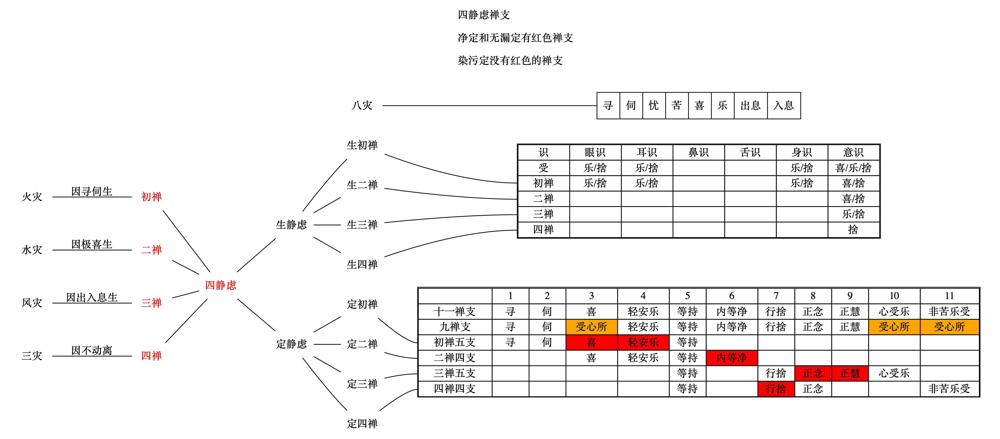

# 分别定品第八

[TOC]

## 卷28

分别定品第八之一

开始讲定。

### 心一境性

定，善的心一境性。心专注道一个境上。精诚所至，金石为开。

### 四静虑

1. 禅定的果，是生静虑。比如这一辈子如果修得初禅，来世决定生初禅天。
2. 善的心一境性。就是善的三摩地。静虑也有染污的，虽然是染污的，但也有审虑的作用，邪的审虑，不是正的审虑，也叫恶静虑。
3. 定和慧的关系。慧如蜡烛，定如蜡烛外面一层玻璃围着，这样烛光不会忽暗忽明。
4. 无色界定，不如四静虑殊胜。理由如表。
5. 分为四个静虑，是因为禅支的不同。

### 四无色定

1. 无色，也有生和定。
2. 修空无边处的近分定的时候，要欣上厌下。因为要观第四禅的粗苦障。
3. 从无色界没，生欲界色界，色从熏习在心上的色种子起现行。入无心定的时候，种子都熏在色上。
4. 没有禅支。
5. 没有定共戒。因为没有色法。
6. 四无色定。
   1. 空无边处。色法有过患，要超脱色法。
   2. 识无边处。空也不要，留识。
   3. 无所有处。识不要。能缘所缘都没有了。
   4. 非想非非想处。
      1. 非想。无所有处的想还是一个东西。不要想。
      2. 不是非想，因为外道害怕已经没有色了，想也没有。
      3. 微微想，极微想有。昧劣想。

### 八等至

1. 三摩地。       等持。定心，散心都有。不通无心。心一境性，
2. 三摩钵底。   等至。
   1. 有心。心离开沉掉，           平等地进入这个定，叫等至。
   2. 无心。没有心的沉掉。四大平等地进入这个定，叫等至。
3. 三摩呬多地。等引。散心没有。专致的心引入这个定，叫等引。
4. 净等至，是味等至所贪著的定。因为感到净等至很好，起了贪著，就是去了原来的净等至，成了味等至。
5. 非想非非想处，不能生无漏法。因为昧劣。
6. 无漏的法，贪是站不住的。不能味著无漏等至，因为是出世的。

### 静虑禅支

1. 只有净静虑，无漏静虑中有十八支。
2. 内等净，是清净的信心。
   1. 初禅已经离开五欲，再离开初禅这个定地的染污，这个信心生起来是极大的喜乐。净就是信，信以净为相。
   2. 离开寻伺，寻伺是东想西想，是外。定内平衡地等流下去。叫内等。
3. 轻安乐，和行捨，作用相反。
   1. 行捨。行蕴里的捨心所。对治掉举。不是舍受，也不是捨无量心。
   2. 轻安对治沉的。相是漂举的。轻安是一个心所法。
4. 支，资助，随顺，显成的意思。
5. 正慧。三禅的乐，是最大的乐，没有智慧对治，就会执著这个乐。
6. 正念。为了出离二禅的喜和三禅的乐。
7. 静虑四支五支。
   1. 第一种解释。
      1. 初静虑。欲界地是散地，烦恼也最重。要离开欲界的烦恼，恶不善法很困难。所以要5支。
      2. 第三静虑。第二静虑有极重的喜，离开很困难。所以要5支。
   2. 第二种解释。超定法。
      1. 初禅到三禅。跳一个禅，支数相同。5支到5支。支数不同不好跳。
      2. 二禅道四禅。跳一个禅，支数相同。4支到4支。支数不同不好跳。

### 禅支体性

1. 18禅支的体，只有11个。把受合并，只有9个法。
2. 轻安乐。
   1. 是轻安心所。心受乐是受心所。
   2. 经部。初二禅的乐是身乐，不是轻安乐。静虑中有身识。
3. 初禅二禅的心受，是喜。身受乐是有的，但是入定的时候，内门转，乐受不可能起。
4. 染污定，没有18支。
   1. 第一种说法。除去表中红色部分。一般采取这个说法。
      1. 初禅。没有喜乐，因为初禅本地的染污没有离开。
      2. 第二禅。第二禅的染污把内等净混浊，搅乱。
      3. 第三禅。染污定，被第三禅的乐所搅乱，所以没有正念，正慧。
      4. 第四禅。没有捨，念。表中少了念。
   2. 第二种说法。
      1. 没有轻安和行捨。因为这两个都是大善地法。染污定没有善法。染污是不善法和有覆无记法。
      2. 这个说法不太好。因为信也是大善地法，但是染污定里却又。

### 不动

第四禅叫不动。

1. 没有八种灾患。 寻伺两种，苦乐忧喜四种，入息出息两种。
2. 其他论师。第四静虑，与密室灯一样。本身一点也不晃动。能够照的很清楚。

### 生静虑的受

参见下表生静虑。

### 起下心

生在上三静虑。

1. 可以起眼，耳，身识，以及发表业的心，借用初禅。
2. 是无覆无记的通果心，或威仪路。因为下面的染污心已经断掉，下面的善心不起因为下面劣上面殊胜。
3. 身识，是威仪无记。
4. 眼识，耳识。
   1. 修的。是通果无记。
   2. 不是修的。威仪无记。
5. 发表心。威仪无记。

### 得等至

1. 第一次得等至得情况如上图。开始一点也没有得到，初次得，就是下面四种净定里一个也没有得到的时候。不包括近分定。
2. 净等至由受生。染污等至也由受生。比如初禅顺退分， XXXXX为什么顺退分有初禅染XXXX
   1. 离开欲界染时，得到初静虑的顺退分。                                                                ————离染得。
   2. 离开初禅染时，得到初静虑的顺住分，或顺胜进分，或顺抉择分，捨顺退分。   ————离染捨。
   3. 初禅的染，本来是离的，又有了，得顺退分，捨顺住分，顺胜进分，顺抉择分。————退得。
   4. 欲界的染，本来是离的，又有了，捨初禅顺退分。                                              ————退捨。
   5. 从二禅生到初禅，得初禅顺退分。一般生下地得下地染污定。                            ————生的。
   6. 从初禅生到欲界，捨初禅顺退分。                                                                       ————生捨。

### 四种净定

1. 顺退分。很容易退。
2. 顺抉择分。能够产生无漏定。顺无漏的。
3. 有顶，可以生下地无所有处的无漏。

### 等至相生

加行的善，不会命终。

### 超等至

1. 有漏的善，无漏的善，这两个可以修超等至。
2. 超等至相关名词。
   1. 往上是顺，往下是逆。
   2. 同类叫均。有漏生有漏，无漏生无漏。
   3. 异类叫间。有漏生无漏，无漏生有漏。
   4. 相邻名次。初禅到二禅。
   5. 越一名超。初禅跳到三禅。
   6. 间超为成。一个有漏，一个无漏，跳的，修成功。
3. 修超等至的具体过程。
   1. 有漏八地。
      1. 顺的。初禅到二禅，二禅到三禅。。。到有顶。
      2. 逆的。有顶到无所有处，。。。。。。到初禅。
      3. 均。次。
   2. 无漏七地。除有顶。
      1. 顺的。
      2. 逆的。
      3. 均。次。
   3. 有漏，无漏。顺逆间次。初禅有漏，二禅无漏，三禅有漏。。。无所有处有漏，识无边处无漏。。。初禅有漏。
   4. 有漏。           顺逆均超。初禅有漏，三禅有漏。。。无所有处有漏。。。。初禅有漏。
   5. 无漏。           顺逆均超。这样，超静虑的加行满了。
   6. 有漏无漏。    顺逆间超。这样，超静虑修成功。
4. 决定三洲人能修，而且是不时解脱阿罗汉。
5. 修灭尽定，起码是三果。

### 等至所依身

1. 等至依自地和下地身来修。得到胜的不会修下边的。
   1. 初禅身，   起初禅的定。
   2. 欲界身，   起初禅的定。
   3. 二禅身，不起初禅的定。
      1. 上地起下地无用。
      2. 上地定胜。
      3. 下地定劣，不会去求。
      4. 下地的已经捨掉了。
      5. 下地法可厌可弃。
2. 有顶没有无漏道。有顶圣者要断烦恼，要起无所有处的无漏定，断有顶烦恼。不起其他地的无漏道，是因为目的是断烦恼，最近的最方便，不是游山玩水。

### 等至所缘境

1. 味等至。
   1. 缘自地的有漏。下地已经离掉了。
   2. 贪著自地。
   3. 不缘无漏。缘无漏就成了善法。
2. 净等至。无漏等至。
   1. 缘一切。XXXXX为什么XXXXXXX
   2. 无漏等至，不缘虚空，非择灭这两个无记无为法。无漏缘四谛16行相，里面没有无记无为。
   3. 根本善无色定。XXXXX为什么XXXXXXX
      1. 净等至。    缘自地和上地法。不缘下地有漏。缘下无漏。
      2. 无漏等至。缘自地和上地法。    缘下地有漏。缘下无漏。

### 等至断惑

1. 无漏等至能断惑。
2. 有漏的近分定也能断烦恼。世间禅定，只有近分定能断惑。
3. 中间禅，不是近分定，也不能断惑。

### 近分定

1. 近分定。有八个。
   1. 初禅近分有寻有伺。
   2. 二禅近分无寻无伺。
2. 捨受相应。因为正在跟烦恼打仗。
3. 都是善的有漏定。
4. 初禅近分定，可以通无漏。
5. 近分定都没有味定。
   1. 因为正在离染。
   2. 另一种说法。未到地定有味等至，有贪著它本地禅味的染污定。一般都是根本定贪的，但是因为第一次得，根本定的味道还没有尝过，未到地定也有些味道，也贪著。

### 中间静虑

1. 近分定和中间定是不一样的。
2. 中静虑有味，净，无漏三种等至。生静虑没有无漏的。
3. 舍受相应。顺正理论给的两个说法。
   1. 没有眼，耳，身三识。所以没有乐受。
   2. 没有喜乐，他正在用功。
   3. 没有忧苦，已经离欲。
4. 招大梵天果。

### 寻伺三等持

1. 有寻有伺地。初静虑，未到地定。
2. 无寻唯伺地。中间静虑。
3. 无寻唯伺地。二禅以上。包括近分定。

### 单空等三等持

1. 空。和空，非我行相相应的定。跟涅槃相似，不是要厌捨的。

2. 无相。涅槃离十相。

3. 无愿。

   

4. 三解脱门。是这三个中无漏的那一部分。能与解脱涅槃做一个入门。

5. 这三个不通味等持。

### 重空等三等持

1. 空空。
   1. 缘空相。把前面无学的空三摩地空掉，叫空空三摩地。
   2. 空跟厌比较相顺，非我不一定顺厌。所以取空相，不取非我相。大毗婆沙里比喻，一个人在旷野行走很害怕，突然来一个陌生人，不是我，但是欢喜他，有人作伴了。
   3. 跟尸杖，吃药一个道理。先用空把烦恼烧掉，然后空三摩地就不要了，叫空空三摩地。
2. 无愿无愿。
   1. 对无学的无愿三摩地，起一个非常的行相，非常的就没什么可以希愿的，所以说无愿无愿。
   2. 不取无愿里的苦，因集生缘这5个行相，因为无愿三摩地是圣道，没有这些相。
   3. 不取道如行出这4个行相，因为这四个行相，还有欢喜的意思，不能厌。现在要把道谛捨掉。
3. 无相无相。
   1. 无学的无相三摩地，是无漏法，没有择灭，那就是非择灭。
   2. 观无相三摩地的非择灭。本来是无相，现在把无相也扫掉，所以叫无相无相。
   3. 取静行相。把无相也息下去。
   4. 不取灭，妙，离。
      1. 灭，跟无常的灭要混淆。
      2. 妙，是善。非择灭是无记。
      3. 非择灭，不是择灭的离系果，也无所谓离。
4. 这个三个叫重二。
5. 这三个是有漏的。
6. 人三洲，不时解脱阿罗汉才能起。
7. 十一地起。欲界，未至，中间，四根本，四无色。二禅及以上的7个近分不能起。

### 四等持

1. 味静虑，没有现法乐住。
2. 现法乐住。住在现法当中很寂静很安乐。没有特别去攀缘。
3. 殊胜知见。
   1. 先修光明定。先观小的光，再观大的光。最后虚空遍法界都是光明。这么观得了光明定。
   2. 得到光明定后，取光明想。修到圆满的时候，就在自己的肉眼旁边，色界清净的四大种生起一个天眼。依靠色界定。
   3. 清净眼识相应的慧心所，叫知，也叫见。

## 卷29

分别定品第八之二

开始讲定的功德。

### 四无量

1. 不断烦恼。但是把烦恼压下去得力量极大。
   1. 有漏根本静虑摄。有漏定在近分定才能断烦恼。
   2. 胜解作意相应，只是一个良好的愿望而已。断惑要真实作意。
   3. 遍缘一切有情。断惑要缘法，16行相都是缘法的共相。
   4. 四无量的本身不断惑，加行位的时候，能够制服。。
2. 无量。
   1. 所缘境是无量的有情。
   2. 产生的福也是无量。等流果。
   3. 所感的果也是无量。异熟果。
3. 只有四个无量，因为是能对治的法门。对治表中四个多行障。多行障每一个人都有，而且经常会发生。
4. 缘欲界有情，因为对治的是嗔等障，上界没有嗔，也没有欲贪。
5. 慈无量心。
   1. 就是慈心定。
   2. 希望一切有情都得这样的快乐。发这个愿心。这是慈心定的加行。
6. 悲无量心。
   1. 有部。无嗔为体。
   2. 世亲菩萨。拔苦，是不害。
   3. 愿有情离苦。这是悲等至的加行。
7. 喜无量心。
   1. 一切有情得到快乐，离开一切苦，我心里很舒服，很高兴。这是喜等至的加行。
   2. 依初二静虑。因为三禅以上没有喜。
8. 捨无量心。怨亲平等。
   1. 有部。体是无贪。
   2. 世亲菩萨。对冤家无嗔，对亲家无贪。
   3. 一切有情平等平等，没有怨亲。这是捨等至的加行。
9. 除喜以外。其他三个依，
   1. 六地。    未至，中间，四静虑。
   2. 或五地。           中间，四静虑。
      1. 未到地定正在断烦恼，没有功夫修无量。
      2. 是容预位，已离欲者方能修故。 XXXXX不是很懂XXXXXX
   3. 或十地。欲界，四根本，四禅近分，中间定。把定，不定，加行，根本都算进去了。
10. 修行方法。只有人能修。
    1. 假使你自己受到什么快乐，那你就起这个念头，希望这个乐，一切有情同样地能受到。
    2. 如果烦恼蛮盛的。对一切有情的平等心起不来，要做三品的想。
       1. 亲。       继续分
          1. 上亲。
             1. 和尚，亲教师，剃度师。传法身的，最重的亲。法身为主。
             2. 父母。
          2. 中亲。财上有往来。法上有往来。以佛法为重的。
          3. 下亲。只有财产上的往来。
       2. 处中的。不继续分。
       3. 怨仇的。继续分
          1. 下怨。夺亲友的命缘资具，养身的生命财产。
          2. 中怨。夺自己的命缘资具，养身的生命财产。
          3. 上怨。害自己的命，夺名誉，夺亲友命。
    3. 按照上面的七中划分，从上亲开始，到上怨。
    4. 上怨修成之后，这样的胜解，还需要数习力经常修。
    5. 把上亲和上怨，修的一样，一定要数习力。
    6. 所缘的人，有情，扩大。所有一切欲界有情，都给他与乐的心，充满十方世界。
    7. 这样慈无量心修成。
    8. 修悲无量的方法，观一切有情，在苦海里面，头出头没漂浮，苦的很。发一个愿，使他离开一切的苦。
    9. 修喜无量的方法，看到众生离开苦，得了安乐，自己深深地高兴，欣慰的这个心。
    10. 修捨无量心，从处中的人开始修。再冤家放下，最后对亲家也要不起贪。

​	

### 八解脱

