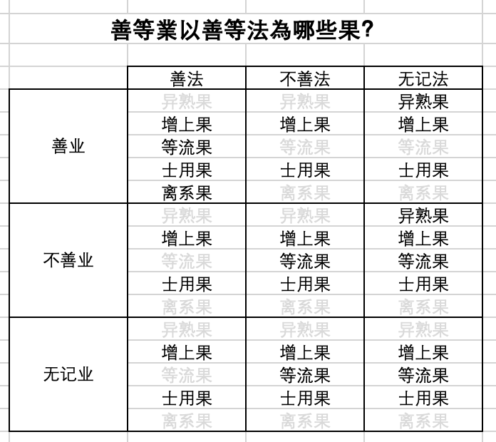
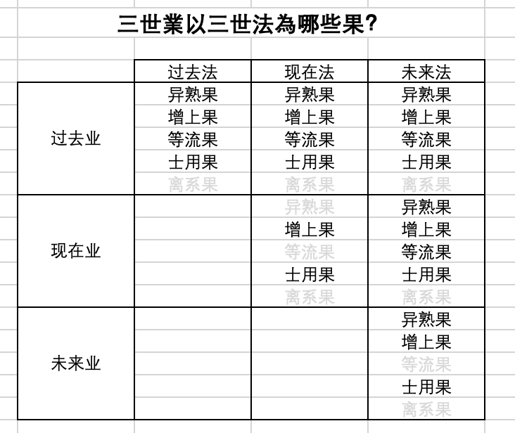
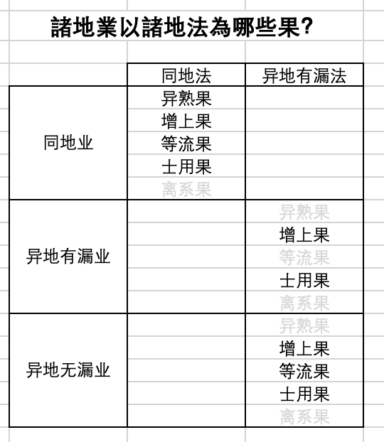
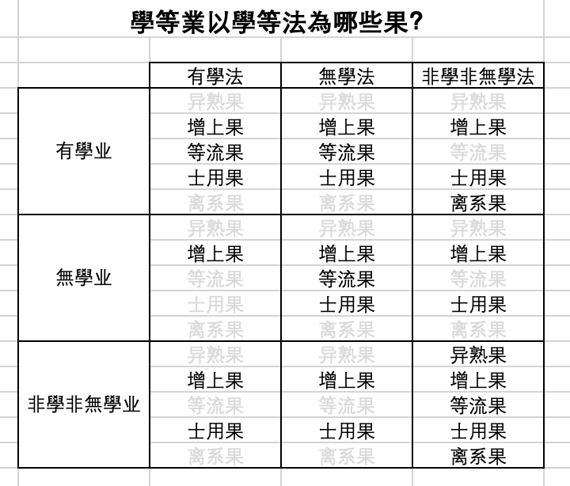
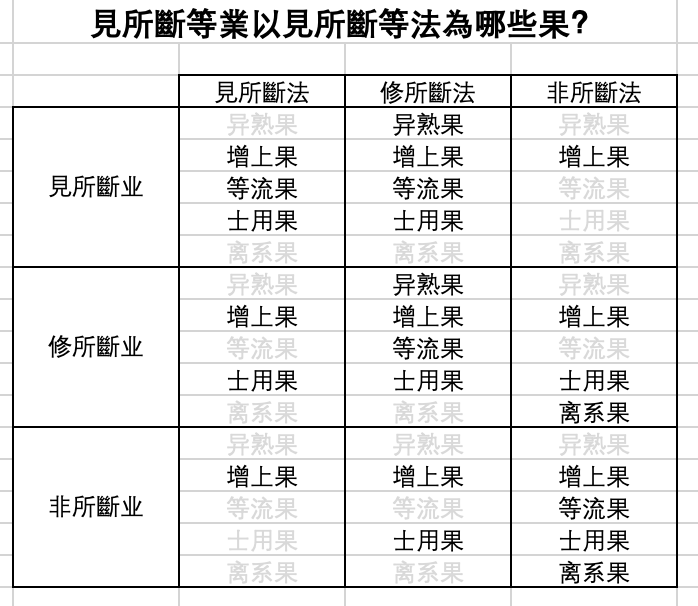

# 分别业品第四

## 卷16

分别业品第四之四

### 四业

1. 黑黑业。欲界不善业。

2. 白白业。色界善业。

3. 黑白黑白业。欲界善业。

4. 非黑非白业。断前三的无漏业。

### 无漏断

个别无漏法才能断前三有漏业。哪些呢？

1. 四法忍。断欲界见所断烦恼。断除纯黑业。 
2. 离欲前八无间。断欲界前八品烦恼的八个无间道的思心所，断除前八品纯黑业。
3. 离欲第九无间。断欲界第九品烦恼的无间道的思心所，断除纯第九品黑业，黑白业（缘缚断）。
4. 四静虑第九无间。四静虑的第九无间道的思心所，断除纯白业（缘缚断）。

### 其他关于四业的说法

1. 有一种说法：地狱业是黑的。其他欲界业是杂的。
2. 有一种说法：欲界见道所断的业是纯黑，其余欲界修所断的业是杂。

### 三牟尼，三清净，三妙行

1. 三牟尼。无漏的。
   1. 身牟尼。无学的身业。
   2. 语牟尼。无学的语业。
   3. 意牟尼。无学的意，心王。真正的牟尼是心，心你看不到，就從身語上來看了。
2. 三清净。不僅僅是無漏的，有漏的善也在裏邊。
3. 三妙行。同三清净。翻三恶行。
   1. 善身业。
   2. 善语业。
   3. 善意业，无贪，无嗔，正见。

### 三恶行

1. 恶身业。
2. 恶语业。
3. 恶意业，贪，嗔，邪见。

### 十业道

1. 业道体。前面说的恶行里面的粗品是十恶业道，妙行里面的粗品是十善业道。
2. 十恶业道。
   1. 身三。杀，盗，淫。要根本。
   2. 口四。虚诳语，离间语，粗恶语，杂秽语。
   3. 意三。贪，嗔，邪见。

### 业道差别

1. 七恶业道中，身三口四，不包括邪淫，一定有无表色。这七个如果自己做的话，表色无表色都有。
2. 七善业道中，身三口四，从他人受得来，必定有表色无表色。不是受生得善的事情，不一定两个都有。定共戒和道共戒，都是定中得，只有无表色。
3. 业道的加行，必定有表业，无表不一定有。业道的后起，无表色决定有，表业不一定有。
4. 意业道，也就是贪嗔邪见，没有加行和后起，起了就是根本。
5. 十恶业道的加行，都可以从三根生，谓贪，嗔，痴。贪，嗔，邪见这三个业道，有三不善根做等无间缘，所以也说从三不善根所生。
6. 善业道的加行，根本，后起，都是从三善根起，三个善根同时起来。
7. 比丘四依。常乞食，树下坐，粪扫衣，陈弃药。
8. 杀，粗语，嗔恚，嗔心完成。偷盗，邪淫，贪，贪心完成。邪见，痴完成。余下三个业道，三个不善根都可以完成。
9. 业道依处。
   1. 杀，粗语，嗔恚，对有情处。对非情不成业道。
   2. 偷盗，邪行，贪，于众具处起。包括情，非情。
   3. 邪见，名色处起。
   4. 虚诳语，离间语，杂秽语，于名身等处起。
10. 行杀的和所杀的人同时死，或者行杀人先死，不成根本业道，因为依身已换。叫人杀，或者很多人一起，其中一个人杀，成业道。

### 十恶业道相

### 杀生

杀的是相续，杀的是未来。

1. 故思。存心要杀，起了杀心。
2. 于他有情。杀的对象是其他有情。
3. 他有情想。比如他是有情，你当成一棵树，不成根本罪。
4. 作杀加行。拿刀等动作。
5. 不误而杀。杀的时候没有杀错。还要命终。

### 不与取

1. 故思。
2. 他物。拿自己的东西不是盗。
3. 起他物想。他人的东西，你以为是自己的。

4. 偷盗加行。暴力抢或者偷。
5. 不误而取。有的书说离开本处就成盗罪。

### 邪淫

比丘尼是国王守护，另外受了348条比丘尼戒，属于第四条。

1. 非境。他妻，父母，父母亲人乃至王所守护的。
2. 非道。自妻口及余道。
3. 非处。地方不对。比如寺院，有鬼神的地方，旷野。
4. 非时。怀胎，哺乳，受八关斋戒的时候。

### 虚诳语

1. 异想发言。说的跟想的不符合。
2. 对方懂了你的话。
3. 起染污心。欺骗，想打诳语的心。
4. 不误。话没有说错。

### 见闻觉知

前五识无比量境，因为前五识无分别。

|          |        见        |     闻     |          觉          |                     知                     |
| :------: | :--------------: | :--------: | :------------------: | :----------------------------------------: |
|   有部   |       眼见       |    耳听    | 意识的现量境和比量境 | 鼻舌身所证。前三有善恶无记，这个只有无记。 |
|   经部   | 前五根，现量所证 | 听来的六境 |      意识比量境      |           意识现量境，比如定中。           |
| 先轨范师 |       眼见       | 听来的六境 |      意识比量境      | 耳，鼻，舌，身的现量境，以及意识的现量境。 |

### 离间语

1. 染污心。起染污心要离间他们。
2. 说离间的话。
3. 听到的人懂了。
4. 不误。要说的话没有说错。

### 粗恶语

1. 起染污心。
2. 说不使别人高兴的话。
3. 听到的人懂了。
4. 不误。要说的话没有说错。

### 杂秽语

1. 起染污心。
2. 说话。

其他论师说，离开虚诳语，离间语，粗恶语，其他带染污心的话叫杂秽语。

1. 佞，就是谄诳，说一些讨好人的话，谄曲的样子。
2. 唱男女感情的歌，倡伎的歌。
3. 持不正见说的话。
4. 染污心的悲叹，世间的戏论，空话闲话。

轮王，北洲他们烦恼轻，虽然有歌咏等，但不属于业道。

### 意业道

1. 贪业道。不合理的要求，贪心，想要人家的财，包括有情非情。
2. 嗔业道。对有情起嗔恨心，想要做伤害的事情。
3. 邪见业道。
   1. 无施与。没有布施的福。
   2. 无爱乐。没有持戒的福。
   3. 无祠祀。没有修的福。
   4. 无妙行。做了好事，不感乐果。
   5. 无恶行。做了坏事，不感苦果。
   6. 无妙恶行业果异熟。认为这两种业无异熟果。
   7. 无此世间，无彼世间。这个世间是过去因结的果，是未来因。彼世间是这个世间的因， 或者是另外世间的果。认为没有这些。
   8. 无父无母。不承认父母有生这个孩子的业报。认为投生是偶然的。
   9. 无化生有情。不承认有化生有情。
   10. 无世间。
   11. 无沙门或婆罗门。
   12. 无阿罗汉。

## 卷17

分别业品第四之五

### 业道

思心所所游履的叫道，业之道。

意业是思心所。

1. 贪，嗔，邪见，这三个是道不是业。思是根据贪， 嗔，邪见的力量来决定事情的，有造作，叫业。思心所在贪，嗔，邪见上面跑，所以这三个叫道。

2. 身三口四，既是业，也是道。身语起作用是思心所在发号施令。身语业本身也是业。贪，嗔，邪见本身不是业。

根本叫业道，加行后起不叫业道。

### 断善根

1. 十恶业道中，只有邪见能断善根。贪，嗔，痴三不善根，也能断善根，但是是间接的，他们先引生邪见，真正断善根的是邪见。
2. 所断善根是欲界的生得善。因为断善根的时候，加行善已经捨完了。
   1. 生得善。与生俱来的。
   2. 加行善。现世自己努力得来的。
3. 一切邪见都能断善根。包括自界缘，他界缘，有漏缘，无漏缘的。
4. 善根是一品一品断的。下下品邪见，断上上品善根。上上品邪见，断下下品善根。
5. 一切律仪戒都是建筑在善根上。善根断了后，一切律仪戒就没有了。两个一起捨。发戒是由发善心发的。如果一个律仪是某一品善根所等起的，那么这个善根断的时候，这一品律仪也就没有了。加行善生起的律仪，断加行善的时候，这个律仪也没有了。
6. 三洲除北洲的人，男女能断善根。天人有天眼，善恶业果看得清楚，不会起邪见。地狱，恶鬼，畜生，苦趣的众生不像人那么敏利，意志和慧的力量不坚强。黄门，二形意志也不坚定。
7. 见行人才能断善根。意志坚强。
8. 断善根的体是非得。

### 续善根

1. 续善根是怀疑做好事没有乐的果，做坏事没有苦的果，怀疑心起，就能续善根。
2. 续善根，九品一起升起来。
3. 犯了五逆罪的人，这一辈子不能续善根。
   1. 地狱里苦受够了，快要出地狱了，善根生起来。坚定的人，宿习邪见，好多生都是邪见。
   2. 将要投生地狱时，善根生起来。不是很坚定的人，信他人的话而断善根的。
4. 爱乐坏。心里起邪见，同时也是按邪见做事。这辈子不能续善根。
5. 戒见坏。心里起邪见，做事情戒律业违背了，这辈子不能续善根。见跟戒，见更重要。

### 断善根与五逆罪四料简

1. 断善根，不造五逆。
2. 没有断善根，造了五逆罪。阿阇世王，杀父。后来信佛。
3. 断善根，造五逆罪。天授，就是提婆达多。
   1. 出佛血。
   2. 破和合僧。
   3. 杀莲花色比丘尼。这位比丘尼是阿罗汉。
4. 不断善根，不造五逆罪。一般的人。

### 业道思俱转

1. 不善业道与思心所俱转。刹那等起。

   1. 一俱转。
      1. 身三口四不起。意里起一个。贪，嗔，邪见行相各不相同，不可能一刹那都起来。
      2. 遣使杀，盗，妄语，绮语，两舌，恶口。使者在做这些的时候，如果断命等，遣使的人成就业道，但这时没有染污心。因为遣使的时候有染污心，业道成就时是另外一个时间，不一定成就染污心。

   2. 二俱转。比如杀业，以嗔心究竟。
   3. 三俱转。
      1. 偷有生命的东西，偷来断其命根。杀和盗同时成就，杀的时候心理同时起的嗔心。
      2. 派两个人去做前面的六个业道，其中两个在同一时间完成。同时遣使的人起贪，或嗔，或邪见。
   4. 四俱转。
      1. 离间语，虚诳语，杂秽语，加意业道随一。
      2. 离间语，粗恶语，杂秽语，加意业道随一。
      3. 遣使，三业道同时究竟。同时遣使的人起贪，或嗔，或邪见。
   5. 五俱转。遣使，四业道同时究竟。同时遣使的人起贪，或嗔，或邪见。
   6. 六俱转。遣使，五业道同时究竟。同时遣使的人起贪，或嗔，或邪见。
   7. 七俱转。遣使，六业道同时究竟。同时遣使的人起贪，或嗔，或邪见。
   8. 八俱转。遣使，六业道同时究竟。同时遣使的人邪淫，以贪究竟。
   9. 贪，嗔，邪见，不会同时现前。所以没有九俱转和十俱转。

2. 善业道与思心所俱转。刹那等起。律仪和处中律仪一起算。单从律仪来说，无1,8,5俱转。

   1. 一俱转。恶心或无记心，持一个戒，是处中无表，不是人类，是鬼神之类，只能生妙行，不能得别解脱戒，只有一个俱转，但是也可以成业道。
   2. 二俱转。
      1. 无贪，无嗔俱转。起一个善五识。善五识不是见性。
      2. 无贪，无嗔俱转。人在无色界，无别解脱律仪，无定共戒，尽智，无生智生起，没有追求，没有分别心，没有希求，正见也不起，只成就无贪无嗔两个业道。
   3. 三俱转。正见相应意识，有无贪无嗔。没有受七种律仪。
   4. 四俱转。恶心或无记心，所以没有无贪，无嗔，正见，此时得近住，近事，勤策戒。身三口一。
   5. 五俱转。
      1. 善意识现前，无贪无嗔正见。持两个戒，是处中无表。
      2. 恶心或无记心，持五个戒，是处中无表。
   6. 六俱转。善五识现前，无正见，有无贪无嗔。得戒，身三口一。
   7. 七俱转。
      1. 善意识，有正见，无贪无嗔。得戒，身三口一。
      2. 起恶心或无记心，得苾刍戒。身三口四。
   8. 八俱转。
      1. 善意识，有正见，无贪无嗔。持五个戒，是处中无表。
      2. 善五识，无正见，有无贪无嗔。持六个戒，是处中无表。
   9. 九俱转。
      1. 善五识。得比丘戒。无贪无嗔，身三口四。
      2. 依无色界定，起尽智无生智。得比丘戒。无贪无嗔，身三口四。
      3. 静虑中有定共戒七支。起尽智无生智。无贪无嗔，身三口四。

   10. 十俱转。
       1. 善意识现前，不入定。得比丘戒。无贪无嗔正见，身三口四。
       2. 入定。定共戒道共戒都有七支。无贪无嗔正见。

### 约处成善恶

1. 十恶业道

   1. 地狱。
      1. 粗恶语，杂秽语，嗔，通现行，成就。
      2. 贪和邪见，无现行，只有成就。地狱有生得智，知道过去造什么业，现在受这个果，所以邪见生不起来。

   2. 北洲。
      1. 贪，嗔，邪见，成就，但不现行。
      2. 杂秽语，成就，也现行。比如染污心唱歌。

   3. 其他欲界。十恶业道都通成就，现行。但天，傍生，鬼只有处中无表，无不律仪。人不律仪和处中无表都有。

2. 十善业道

   1. 一切处。无贪，无嗔，正见，都成就，和现行。
   2. 无色界，无想天。身三口四，无现行，只有成就。无色界无无表色，所以没有现行。无想天无心，所以无定共戒，定共戒随心转，但是成就过去未来的定共戒。
   3. 其他欲界，除地狱和北俱芦洲。身三口四，都成就，和现行。鬼，傍身有处中善。色界无别解脱律仪，有定共戒和道共戒。三洲和欲界天处中和别解脱律仪两种都有。

### 业道所得果如何

1. 十恶业道和十善业道，都能感三种果，异熟果，等流果，增上果。
2. 异熟果是正报，增上果是依报。等流果是余报。
3. 造业的时候，有三种不同性质的罪损害人家，那你也要受三种不同的果。

### 邪命是什么

1. 贪所发的身业，语业（身三口四）叫邪命。因为最难除去。
2. 嗔，痴所发身业，语业，叫邪语，邪业。
3. 贪最能吸引人的心，嗔心，痴心吸引力没有那么大。
4. 在家人邪见难除。出家人邪命难除，因为要讨好施主。
5. 有的论师说邪命是缘命的资具，饮食，衣服，卧具，医药，从这些地方生贪，叫邪命。世亲菩萨说不对，跟经违背。戒蕴经中，佛说看象斗也是邪命。

### 诸业所得果

1. 无间道叫断道。
   1. 有漏的无间道。依世间禅定。暂时断。具足五果。
      1. 自地可爱异熟果。
      2. 自地，若等若胜诸相似法。等流果。
      3. 离系果。
      4. 俱有士用果。无间士用果。隔越士用果。不生士用果。
      5. 增上果，除自己以外的所有有为法，除前生。
   2. 无漏的无间道。依佛法。永远断。五果中除异熟果。
2. 剩下的有漏的善业和恶业。五果中除离系果。
3. 剩下的无漏和有漏的无记业。五果中除异熟果和离系果。无记力量弱，不感异熟果。

### 善等业以善等法为哪些果？

善，恶，无记三业，感善，恶，无记的法，分别有多少果。

善等三业，色蕴行蕴为体。感的果，五蕴都有。

无记法为什么可以做不善业的等流果？遍行因中身见，边见是无记的，其他是不善的。这些遍行的不善法和见苦所断的余不善法，这一些能够引生身见，边见。这个身见，边见是它的等流果。身见边见是有覆无记，是染污性的，不善法也是染污性的。同是染污的，可以有等流果。

染污的身见，边见可以做同类因，产生其他染污的不善法，所以无记业可以有不善的等流果。

### 三世业以三世法为哪些果？

三世业，色蕴行蕴为体。感的果，五蕴都有。

离系果是无为法，不属系世的，不是三世所摄。异熟果是异时而熟。

同类因要因在前，果在后，才能有等流果。

未来的法还没有生出来，哪个在前，哪个在后还没有决定，所以不好说等流果。那为什么有异熟果呢？遍行與同類，二世三世三。为什么是二世呢？

### 诸地业以诸地法为哪些果？

诸地，指三界九地。虽然有九地，但分起来只有同跟异。同地，比如欲界造业，欲界受果。异地，比如欲界造业，初禅受果。

无漏法对无漏法可以有等流果，因为无漏非地系。

### 学等业以学等法为哪些果？

非学非无学，包含凡夫，还包含三无为法。

学，无学，非学非无学的业，体是色蕴和行蕴。

1. 学，无学的色蕴是无漏戒，即道共戒。行蕴是道共戒，是无漏的思。
1. 非学非无学，色蕴是有漏的色蕴少分，有漏的身语二业。

有学法是有为法，不是离系果。有学法是无漏的。

### 见所断等业以见所断等法

见所断所造的业，行蕴少分为体，是与见惑相应的思心所。没有色法，因为色定非见断。

修所断，非二断的业，色蕴，行蕴两个少分为体。

见所断法，四蕴为体，无色蕴。唯染污，非异熟。

修所断法，五蕴为体。

非所断法，有为的无漏法，以及无为法。

### 应作业，不应作业，非应作业非不应作业

1. 不应作业。
   1. 染污心生的身业，口业，意业。
   2. 有的说还要加上违背轨则威仪的。威仪本来是无记，破坏威仪不是染污的。轨则是威仪。
2. 应作业。与不应作业相反。
   1. 善的心生得身业，口业，意业。
   2. 有的说还要加上合轨，合威仪的。
3. 非应作，非不应作。
   1. 无记业。
   2. 有的说还要减去威仪无记。其余三个无记异熟生，工巧处，通心果。

### 引业满业

1. 引业。
   1. 总报业，投生哪一趣。
   2. 一个引业只能引一生。
      1. 一引业引多生，则受报时间乱了。
      2. 多业引一生，则一生中一段是人，一段是狗等。

2. 满业。
   1. 别报业，投生后的端正，聪明，富有等。
   2. 由多业决定。

野狐身，不是一个引业引多生，因为他的见没有改，所以下一辈子还造同样的引业，又是感野狐身。

除了引业和满业，其他善恶的有漏法，也可以起作用，但是很微小。

1. 其中和业同时生起的，能引也能满。
2. 不与业同时生起的，只能作满业，因为力量太小。无想定，灭尽定就是这类。
3. 善恶的得，只能满不能引，力量微弱。得到的是本身那个法，不是业感的果。

### 三障

障谓障圣道和圣道加行。三障中，

1. 业障。指五无间罪。杀父，杀母，杀阿罗汉，破和合僧，出佛身血。
2. 烦恼障。指数行烦恼，也就是经常起的烦恼，不论上中下品。
   1. 上品烦恼，就是大的烦恼，猛利是猛利，只要不是经常起的，没有习惯性的，还是容易对治的，不叫烦恼障。
   2. 下品烦恼，烦恼再小，虽不猛利，只要经常起的，就是烦恼障。
3. 异熟障。三恶趣全，北俱芦洲，无想天。

这几个障哪些重哪些轻？

1. 1和2最重，因为这两个障，第二生也不可见圣道，起码要第三生以后，因为第二生要去恶道。异熟障第二生有可能。
2. 第二个解释，有部论师。先起烦恼，后造业，再产生果，所以烦恼障最重，然后业障，最后异熟障。

造了无间业，必定堕地狱，命终的时候，中间没有时间间隔，地狱马上生出来。

无间障。

1. 三洲有，除北俱芦洲。三洲里除黄门二形，因为父母对他们少恩，他们对父母的惭愧心轻，羞耻心也不重。
2. 畜生，鬼比人低级一点，虽然害父母，根据扇搋的道理来推，也不成无间罪。
3. 大德说，畜生里面绝顶聪明，灵性接近人的，惭愧心重的，害父母也成无间罪。
4. 一个人的父母是非人，害父母也不成无间罪。

异熟障，五趣都有。异熟障，人趣中只有北俱芦洲有。天趣中唯无想天有。人间假使盲聋喑哑，也可以修道，不算异熟障。

烦恼障，五趣都有。

## 卷18

分别业品第四之六

Page 119.

开始广讲业障

### 业障的体

1. 四身业。
   1. 杀父，杀母，杀阿罗汉。杀生。
   2. 出佛身血。杀生加行。
2. 一语业。破和合僧，虚诳语。说了虚诳语，得了破僧的果。

### 破僧

1. 破僧的体是不和合，心不相应行里的不和合，和合的非得为体。
2. 破僧本身是无覆无记的。破僧的因，虚诳语是无间罪，五无间罪中最重的一个。无间罪的体是虚诳语。无间罪的破僧指的是因，虚诳语。因立果名。
3. 破僧，是所破的僧成就。能破的人造虚诳语。
4. 能破的人成就虚诳语罪，感无间地狱，时间一劫。其他四个无间业，轻的可以不去阿鼻地狱，破僧非去不可，因为是五无间罪里最重的。
5. 无间罪是顺生报，第二生决定受。
6. 造多个无间罪，可能受很多倍的苦。比如两个无间罪，可能受不止两倍的苦，可能无量百千倍。
7. 几个缘成就？
   1. 能破的是见行人，比丘。清净。没有破戒的。
   2. 在异处，不在佛前。佛的威信下破不了僧。
   3. 被破的人是凡夫。不是见道以上的圣者。另外一种说法，得忍的人也不可破。
   4. 被破的人认可除了佛，还有大师。除了佛的八正道，还有更殊胜的法。割截衣，就是福田衣，是田相，给众生培福的，是形象性的福田。
   5. 不过一夜，马上就和合，法尔如此。四人成僧，两边都是四个以上才是破僧。
8. 两种破僧。
   1. 破法论僧。在南赡部洲，因为佛在南赡部洲，离开佛，无所谓破法论僧。要最少9个人。正的一边4个人，邪的一边4个人，加上一个能破的人。
   2. 破羯磨僧。在三洲，除去北洲。三洲只要有圣法，都可以破羯磨僧。最少要8个人，一边4个人，分开做羯磨。
9. 什么时候没有破法轮僧？
   1. 佛初转法轮。因为佛才出现的时候，弟子信心极大。
   2. 佛在临涅槃的时候。大家怀念佛，对佛的信心又生起来的。
   3. 疱。戒上疱，见上疱起之前。
      1. 佛的戒不正，另外立一个邪的东西说是正的戒，是戒上疱。
      2. 佛的正见不是正见，要其他的才是正见，是见上疱。
   4. 双。舍利弗和目犍连。他们两位还没有做佛弟子之前，也不会有破法轮僧，因为要由他们来合拢。
   5. 佛灭度后。因为破法轮僧是跟佛唱反调。
   6. 未结界。佛还没有结界的时候。因为破僧要一个界里分两部分。

### 五无间罪的因缘

成无间罪和不成无间罪的因缘有哪些？

1. 恩田，父母有恩。
   1. 父母转形，比如父亲变女人，杀他也成逆罪，因为依身没变。
   2. 代孕。杀血分母成逆罪，杀代孕母不成逆罪。恩田重点在血分上。试管婴儿同理。
   3. 要杀父母，杀错人，不成逆罪。
   4. 要杀其他人，错杀父母，不成逆罪。
   5. 要杀父母，结果把旁边的人也杀了。表业在父母身上，是无间罪。对旁边的人来说，没有表业，但是有无表业。所以一个无间罪和一个杀人罪，共两个。尊者妙音认为有两个表业。
2. 德田，佛及阿罗汉，具诸功德。自行，化他。
   1. 要杀一个人，不知道他是阿罗汉，心想不管是不是阿罗汉都要杀，杀了后也成逆罪。
   2. 父亲是阿罗汉。杀他只成一个无间罪，因为身体是一个。
   3. 杀心出佛血，出一点血，成无间罪。
   4. 打心出佛血，出了血，不成无间罪。
   5. 杀一个人的时候，他还没成阿罗汉，命终的时候成了阿罗汉，这样不成无间罪。

### 加行决定

假使造逆的加行决定了，虽然没有正式地断命，但无间罪是成就的，离染得果不可能。如果不成就无间罪，那么这一生有希望离染，也可以得圣果。

### 善恶行中最大最重

1. 有漏善行。感第一有，也就是非想非非想天的思，也就是意业，是能得善的最大果报的。八万大劫有顶天享受定乐。
2. 无漏善行。金刚喻定相应的思心所，成佛果。
3. 恶行。五无间里，破僧的虚诳语罪最大。 然后是出佛身血，然后是杀阿罗汉，然后是杀母，然后是杀父。

### 无间罪的同类

这些虽然不是无间罪，但是也是决定要生地狱的重罪。有余师说，虽然要生地狱，但是不是无间生，可能隔生。

1. 杀母同类。污母，污无学尼，与她们做不净行。
2. 杀父同类。杀住定菩萨。三大阿僧祇劫修福德智慧资粮，之后修一百劫相好的时候，叫住定菩萨。
3. 杀阿罗汉同类。杀有学圣者，初果，二果，三果圣者。
4. 破僧同类。夺僧和合缘，就是夺资具，生活用品。
5. 出佛身血同类。破坏佛塔。

### 三时障

以下三个时候，相应的异熟业要障碍。

1. 得忍位。因为得忍以后，三恶趣永远不去，所以一切感恶趣的业要障碍他。
2. 得不还果。欲界不来了，一切欲界的异熟业要障碍他。
3. 得阿罗汉果。三界不来，一切色界无色界的异熟业要障碍他。

障是决定有的。小的障冲过去，不去管他，勇往直前冲过去。大的障，要有点智慧，绕过去，须弥山在前面，硬冲把头冲破了，还是过不去，绕个弯道后头。

### 住定菩萨

从修三十二相八十种好开始，菩萨叫住定菩萨。为什么叫住定菩萨？

1. 生善趣，不生恶趣。
2. 生富贵人家。
3. 诸根具足。不缺不减。
4. 男身。不受女身。龙女成佛，化成男相，不是龙女的身。
5. 宿命。过去生的事情都能够忆念到。
6. 坚固。做善事，修行不会退。

### 住定菩萨修妙相业。

1. 南赡部洲的人。

2. 决定要男子身。

3. 现前对佛修三十二相八十种好。是观佛起思心所的思，是思所成的功德。

4. 需要一百大劫来修。释迦牟尼佛特别精进，超越9劫，提前成佛，一共91劫。

5. 三十二相，每一个都要一百个福来庄严，也就是一百个善的思心所。前面五十个修治身器，后面五十个来圆满它。五十思。十善业道，各有五个思。比如不杀有以下五个。

   1. 离杀思。
   2. 劝导思。
   3. 赞美思。
   4. 随喜思。
   5. 回向思。

   一福量有多少？

   1. 有人说，除了快要成佛的菩萨以外，其余一切有情，包括菩萨，声闻等，所有的福气，受乐的果，业，全部加起来，相当于一个福的量。
   2. 有人说，感一个三千大千世界福报的业，是一个福的量。
   3. 有人说，这个福太大了，无边无际。

### 供养佛

初发心，碰到古释迦摩尼佛，发弘誓言，愿我当作佛，一如今世尊。

1. 初无数劫，供养75000佛。劫满碰到宝髻佛。
2. 第二无数劫，供养76000佛。劫满碰到燃灯佛。
3. 第三无数劫，供养77000佛。劫满碰到胜观佛。

### 六度圆满

1. 布施圆满。单由悲心来普遍地布施，没有其他杂念。普施一切，对一切都布施。
2. 持戒，忍辱圆满。被割截身体，没有一点点嗔恨心。
3. 精进圆满。赞叹底沙佛。
4. 禅定，般若圆满。金刚喻定的时候。

### 施戒修

**有部的讲法如下**：

1. 布施一类。
   1. 身语二业，叫福业事。本身是善的，是福。身语二业有造作的，造作是业。思心所所寄托的地方，依托在身语上，这个叫事。所依的意思叫事。
   2. 身语上的思心所，只能叫福业。因为思心所本身不能寄托在自己身上。
   3. 思心所的俱有法，只能叫福。这些是思心所同时生起的心王心所，得，四相。

2. 戒一类。身三口四，只有身语，没有意业。是福业事。
3. 修一类。定中四无量心。比如修慈心观。
   1. 慈心所。福事。
   2. 和慈心所同时生起的思心所，及定共戒，是福业。
   3. 思心所的俱有法，福。这些是思心所同时生起的心王心所，得，四相。

每一个都有福，都是善的。有些叫事，有些叫业，不一定全部都叫事业。这些差别跟业道一样，有相似之处。

经部的说法。只有思心所这个意业是真的福业。寄托在施戒修上，这三个是事。福业的事，叫福业事。

### 布施

1. 布施的体。无贪的心，发动身语，捨财物，叫施。布施的体是无贪心和能发的身语。
2. 布施的目的。供养福田，饶益悲田。
3. 能发，发动身语布施的无贪心，及心王心所得四相。
4. 捨具。身语业，加上能发，叫捨具，捨的工具，要捨就靠这些。
5. 施类福。福以布施为体。

### 布施的目的

1. 求自己的利益。没离欲的凡夫，圣者，离欲贪异生，供养佛塔。供养的对方毫无利益，供养的人却能够感殊胜的异熟果。纯自利。
2. 求他人的利益。离欲的圣者，布施有情，对方得益，自己不受益，因为自己已经离欲。自己无利益。纯利他。
3. 求自他的利益。没离欲的凡夫，圣者，离欲贪异生，布施有情。自利利他。
4. 没有什么求的。离欲的圣者，供养佛塔。两方面都无利益。

### 布施果报差别

布施果报差别从哪来？

1. 主。布施的人。七圣财，具足的越多功德越大。
   1. 七圣财。深信，对三宝深信。持戒。多闻。智慧。捨施。惭。愧。
   2. 敬重施。布施的时候，很恭敬，很慎重，感得他人尊重。
   3. 自手施。自己亲手布施，感得大财富，受用的时候也如意。
   4. 应时施。人家需要的时候布施，雪中送炭，感得需要什么就来什么的果报。
   5. 无损施。布施的时候不损闹人家，使人家欢喜，感得财物不容易被夺走。
2. 财。布施的东西。
   1. 色。颜色非常好的，感自己身体也长得好。
   2. 香。香味好的，感好的名声，如香一样到处传播。
   3. 味。味道好的，感大家欢喜的果报。
   4. 触。触好的，不粗糙的，感得自己身体柔软，以及随时身体都感觉很舒服。
3. 田。布施的对象。
   1. 趣。供养傍生小于供养犯戒的人。
   2. 苦。
      1. 施行路人。跑远路的人。
      2. 施羁旅客。外面旅游的人， 不是游山玩水，而是有事。
      3. 施病人。
      4. 施看病人。照顾病人的人。
      5. 施寺园林。僧人寺院， 园林。
      6. 施常食。经常布施。
      7. 随时施。寒的时候送热姜，或棉衣。热的时候送冷饮或冷风，或凉棚。
   3. 恩。供养父母，万亿倍的功德。还有生母，养母。
   4. 德。供养持戒的人，亿倍的果。供佛，无量果。

### 最殊胜的布施

一共三种最胜。

1. 脱于脱。解脱的人供养解脱的人。解脱是无学。
2. 最后身菩萨，布施为了使一切有情得最大的安乐。
3. 其他八种。其中第八个是殊胜的。
   1. 随至施。跑到身边来的布施，远地的没有布施。
   2. 怖畏施。由于怖畏而布施的，比如财要被没收，而先布施。
   3. 报恩施。为了报恩而布施。
   4. 求报施。有所求而布施。
   5. 习先施。祖祖辈辈家里的习惯是要布施，他也照先例布施。
   6. 希天施。为了升天而布施。
   7. 要名施。为了要名而布施。
   8. 为庄严心。为了要庄严自己的心，不为求什么。除悭贪心，求得定而布施。

### 布施得无量果

布施圣者，果报无量。布施以下几种，虽然他们还是凡夫，果报也无量。

1. 父母。出家是暂时不管父母，将来还要度他们的。父母长养我们的身体，有恩。
2. 病人。长养我们的悲心，有恩。
3. 法师。长养我们的法身智慧，有恩。世间上最大的善友，是善知识。
4. 最后身菩萨。

### 业报的轻重相

业报的轻和重，有6个原因。由这些因的下品或者上品，造的业也是相应的下品或上品。

1. 后起。比如杀牛后，还要吃肉，用它的骨头等。
2. 田。趣，苦，恩， 德四个田。
3. 根本。根本业道。
4. 加行。引起根本的加行。
5. 思心所。因为这个思心所，才造作业道。
6. 意乐。自己决定要做什么坏事。

### 造作业和增长业

1. 造作业。业本来是造作。
2. 增长业。由五个因素，成为增长业。
   1. 审思。经过认真思考，下了决心做业。善业也有审思。
   2. 圆满。够分量堕恶趣的叫圆满。善业也有圆满。
   3. 无恶作对治。没有忏悔来对治。善业随喜。
   4. 有伴。做了一件坏事后，连同其他坏事一起做。善业做了一件，也附带做其他好事。
   5. 异熟果。造作业不一定感异熟。感异熟果的决定是增长业。对应善业是决定感好的异熟果的。

### 供养佛塔

供养佛塔，佛塔不受用你的东西，那么福从何来？

福有二类。

1. 捨类福。只要布施，福马上生起来。供养佛塔是这类。四无量心也是这类，因为是你自己定中的观想。
2. 受类福。要对方受用布施的东西后，福才生起来。

### 布施三恶趣

布施恶趣，对方这个田不好，但是只要用好的心布施供养，一样得到可爱的果，因为种子和感的果没有颠倒的，但是福不多。

布施是种子。在不好的田里果虽不好，但是有。田好，果也更好。

### 持戒

离开身三口四的性罪，也不做非时食，饮酒等遮罪，就叫戒。戒有两种，表和无表。遮罪受了戒才有。戒具有以下四德，名戒清净。

1. 非犯戒坏。没有被所犯的戒坏掉。
2. 非犯戒因坏。没有起犯戒的因。
3. 依治。四念住等来对治前面的犯戒和犯戒的因。
4. 依灭。一切持戒功德回向涅槃。

另外一种说法，戒清净有五因。

1. 根本净。犯戒的根本罪没有。
2. 眷属净。恶的方便，加行没有。
3. 非寻害，离恶觉。恶寻伺，欲，恚，害，这三个恶觉没有。
4. 念摄受。为三宝正念摄受。
5. 回向寂。回向涅槃。

### 修

定中善叫修，因为这最能改变我们的心。等引，定，就是离开昏沉掉举。

定力量大。闻思都是散心，没有定力量大。

### 戒修果

从通的来说，布施也能感得生天，最后也能感得解脱。持戒也能感得解脱，只是力量不如修那么殊胜。

从殊胜的方面说。

1. 施类福，感得大富。

2. 戒类福，感得生天。

3. 修类福，感得解脱。

### 梵福量

有四种人能生起梵福。梵福是最高尚，最清净的福。

1. 供养如来的驮都，供养如来的身体，就是舍利。
2. 供养十方僧住的地方。造庙，施园林。四事供养，也就是供养饮食，衣服，卧具，医药。
3. 佛弟子，破已能和。把佛弟子，破僧和合起来。
4. 于有情平等地修慈悲喜捨。
5. 为了救母亲的命，牺牲自己的生命。
6. 为了救父亲的命，牺牲自己的生命。
7. 为了救如来的命，牺牲自己的生命。
8. 于如来的正法中出家。
9. 劝人家出家。
10. 劝转法论。那些地方没有讲经说法的，你能劝人家讲经说法。

一劫天上的享受，是一个梵福。

先轨范师，也就是经部或者大众部的轨范师，说四十个中劫是一个劫，大劫的一半，和梵辅天一劫的寿量一样。

### 法布施

法布施的条件。

1. 说法没有颠倒，跟佛说的意思一直，就是如实。
2. 不求名利，就是无染。
3. 要使对方起正解。

### 三种善

有三种善。

1. 顺福分。感可爱的异熟果。人天果报。
2. 顺解脱分。感涅槃。
3. 顺抉择分。暖顶忍世第一，感圣道中的见道。

### 书印算数之类的业

1. 书法，刻图章。身业和能发是体。一共五蕴。
2. 口算，吟诗。语业和能发是体。一共五蕴。
3. 心数。意业和能发是体。一共四蕴，无色蕴。

### 诸法异名

1. 无漏善，叫妙。是灭道二谛。
2. 有染污的法，叫
   1. 有罪。圣者所呵斥的。
   2. 有覆。覆盖圣道。
   3. 劣。下劣的，可以舍弃的。
3. 有为善，叫应习。无为法不能增上，没有果。
4. 解脱，叫无上。
